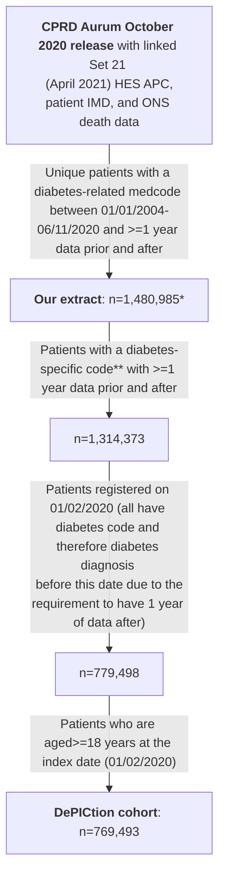

# Initial data quality exploration

## Introduction

The scripts in this directory use a cohort of adults with diabetes registered in primary care on 01/02/2020 to explore data quality issues, particularly around diabetes type coding and diagnosis dates, and determine rules to identify those with poor quality data. The below diagram shows the construction of this cohort:

\* Extract (see upper level of repository for full details) actually contained n=1,481,294 unique patients (1,481,884 in total but some duplicates) but included n=309 with registration start dates in 2020 (which did not fulfil the extract criteria of having a diabetes-related medcode between 01/01/2004-06/11/2020 and >=1 year of data after this; some of these were also not 'acceptable' by [CPRD's definition](https://cprd.com/sites/default/files/2023-02/CPRD%20Aurum%20Glossary%20Terms%20v2.pdf)). NB: removing those with registration start date in 2020 also removed all of those with a 'patienttypeid' not equal to 3 ('regular'). See next section for further details on the extract.

\** The list of diabetes-related medcode used for the extract (see below) included some which were not specific to diabetes e.g. 'insulin resistance' and 'seen in diabetes clinic***'. The list of 'diabetes-specific codes' used to define the cohort here can be found in our [CPRD-Codelists respository](https://github.com/Exeter-Diabetes/CPRD-Codelists/blob/main/Diabetes/exeter_medcodelist_all_diabetes.txt).

\***  We determined the code 'Seen in diabetes clinic' (medcode 285223014) to be unspecific to diabetes after observing a large number of patients (>100,000) in our extract with this code and no further evidence of diabetes such as other codes for diabetes, high HbA1c test results, or prescriptions for glucose-lowering medications.

&nbsp;

## Scripts

See upper level of this repository for notes on the aurum package and codelists used in these scripts.

&nbsp;

### 01_dpctn_cohort
Defines the cohort as per the flowchart above, and adds in patient characteristics (e.g. sex, ethnicity, age at index date) as well as biomarkers values at/prior to index date (BMI, weight, height, HDL, triglycerides, total cholesterol, HbA1c, GAD/IA2 antibodies, and C-peptide), family history of diabetes, and whether they are non-English speaking / have English as a second language.

🔴 **Rule 0: Biomarker cleaning: BMI, HbA1c, total cholesterol, HDL, and triglyceride values outside of the normal detectable range (BMI: 15-100 kg/m2 (used for adult measurements only), HbA1c: 20-195 mmol/mol, total cholesterol: 0.5-20 mmol/L, HDL: 0.2-10 mmol/L, triglyceride:0.1-40 mmol/L) should be ignored.**

We have implemented this in our code.

&nbsp;

### 02_dpctn_diabetes_type_all_time
Uses diabetes type codes to define diabetes type as per the below flowchart:

\* Could also have diabetes codes of unspecified type

&nbsp;

This script also looks at how many diabetes codes, high HbA1cs and scripts for glucose-lowering medication have dates before the patient's birth (and so need to be cleaned). For all code categories, and all high HbA1cs and OHA/insulin scripts, >99.9% were on/after the patient's DOB (and only ~0.3% of cohort (1,994/769,493) are affected). The small proportion of codes/high HbA1c/scripts before DOB were excluded from downstream analysis.

&nbsp;

### 03_dpctn_diabetes_qof_primis_codelist
Looks at effect of restricting the cohort to those with a diabetes QOF code / medcode which maps to SNOMED code in pre-existing PRIMIS diabetes codelist (https://www.opencodelists.org/codelist/primis-covid19-vacc-uptake/diab/v.1.5.3/).

&nbsp;

Diabetes QOF codes: the QOF codelist was constructed from Read codes from version 38 and SNOMED codes from version 44 of the QOF, which include all codes from previous versions. Have only included medcodes which map to Read codes from version 38 and SNOMED codes from version 44 - i.e. haven't mapped between SNOMED and Read codes. Includes some codes for non-Type 1/Type 2 types of diabetes, but not gestational (or malnutrition). Not sure about QOF usage 2020 onwards (doesn't affect this dataset).

Number in each class with QOF code:
* Unspecified: 3,652/114,955 (3.2%)
* Type 1: 31,832/31,922 (99.7%)
* Type 2: 574,340/576,418 (99.6%)
* Gestational only: 167/15,070 (1.1%)
* MODY: 61/61 (100.0%)
* Non-MODY genetic/syndromic: 87/108 (80.6%)
* Secondary: 142/584 (24.3%)
* Malnutrition: 1/1 (100.0%)
* Other: 30,289/30,374 (99.7%)

Median time between most recent QOF code and index date:
* Unspecified: 551 days
* Type 1: 319 days
* Type 2: 295 days
* Gestational only: 911 days
* MODY: 666 days
* Non-MODY genetic/syndromic: 493 days
* Secondary: 513 days
* Malnutrition: 458 days
* Other: 262 days

&nbsp;

PRIMIS diabetes codelist: contains 545 SNOMED codes; 187 are in 05/2020 CPRD Medical Dictionary and match to 753 medcodes (NB: numbers are much higher (458 SNOMED codes matching to 1,415 medcodes) if use more recent medical dictionary BUT none of the new codes are in our download).

Our diabetes codelist (including all types of diabetes) is 1,361 medcodes. 711 of PRIMIS medcodes are in this list, but PRIMIS contains extra 42 medcodes - most are infrequently used ^ESCT codes but these aren't:
| | CPRD Term description |  Original Read code |
| ---- | ---- | ---- |
| 1 | O/E - right eye clinically significant macular oedema | 2BBm |
| 2 | O/E - left eye clinically significant macular oedema | 2BBn |
| 3 | Loss of hypoglycaemic warning | 66AJ2 |
| 4 | Hypoglycaemic warning absent | 66AJ4 |
| 5 | Insulin autoimmune syndrome | C10J |
| 6 | Insulin autoimmune syndrome without complication | C10J0 |
| 7 | Achard - Thiers syndrome | C152-1 |
| 8 | Leprechaunism | C1zy3 |
| 9 | Donohue's syndrome | C1zy3-1 |
| 10 | Mauriac's syndrome | EMISNQMA111 |
| 11 | Ballinger-Wallace syndrome | ESCTDI21-1 |
| 12 | HHS - Hyperosmolar hyperglycaemic syndrome | ESCTDI23-1 |
| 13 | HHS - Hyperosmolar hyperglycemic syndrome | ESCTDI23-2 |
| 14 | Rogers syndrome | ESCTME15-1 |
| 15 | Herrmann syndrome | ESCTPH1-1 |
| 16 | Kimmelstiel - Wilson disease | K01x1-1 |

In PRIMIS codelist, some the term descriptions for these codes contain 'diabetes mellitus' but don't in the CPRD Medical Dictionary. We can't really investigate whether these codes would pick up more people than our codelist as our extract relied on our codelist (although could look in full download).

Number in each category with any of the 753 PRIMIS medcodes:
* Unspecified: 9,592/114,955 (8.3%)
* Type 1: 31,913/31,922 (100.0%)
* Type 2: 575,677/576,418 (99.9%)
* Gestational only: 393/15,070 (2.6%)
* MODY: 61/61 (100.0%)
* Non-MODY genetic/syndromic: 87/108 (80.6%)
* Secondary: 584/584 (100.0%)
* Malnutrition: 1/1 (100.0%)
* Other: 30,357/30,374 (99.9%)

&nbsp;

The top diabetes medcodes (from our codelist of 1,361) most frequently used by those in the 'unspecified' group are as below:
* (13,964 (12.1%) have a high HbA1c measurement)
* 12,140 (10.6%) have 216201011 'Diabetic retinopathy screening'
* 11,592 (10.1%) have 616731000006114 **'Diabetes monitoring first letter'**
* 9,255 (8.1%) have 264676010 **'Diabetic monitoring'**
* 9,142 (8.0%) have 1488393013 'O/E - Right diabetic foot at low risk'
* 9,110 (7.9%) have 2533110014 **'Referral to diabetes structured education programme'**
* 9,108 (7.9%) have 1488397014 'O/E - Left diabetic foot at low risk'
* 8,005 (7.0%) have 200111000006116 **'Diabetes mellitus diet education'**
Next most popular are 'Diabetic annual review' and 'Seen in diabetic eye clinic' codes

If we look in the 91.7% (105,363) without a PRIMIS diabetes code, the top diabetes medcodes are:
* (9,359 (8.9%) have a high HbA1c measurement)
* 8,924 (8.5%) have 616731000006114 **'Diabetes monitoring first letter'**
* 8,192 (7.8%) have 216201011 'Diabetic retinopathy screening'
* 7,460 (7.1%) have 2533110014 **'Referral to diabetes structured education programme'**
* 7,428 (7.0%) have 200111000006116 **'Diabetes mellitus diet education'**
* 5,939 (5.6%) have 264676010 **'Diabetic monitoring'**
* 5,511 (5.2%) have 21631000000117 **'Diabetes monitoring administration'**
* 5,207 (4.9%) have 546471000000114 **'Diabetes structured education programme declined'**
* 5,122 (4.9%) have 616741000006116 **'Diabetes monitoring second letter'**
* 4,601 (4.4%) have 457231013 'Seen in diabetic eye clinic'

59,950/105,363 (56.9%) of those without a PRIMIS diabetes code have a single diabetes medcode only (and no high HbA1c measurements or OHA/insulin scripts). Their top medcodes are:
* 4,156 (6.9%) have 616731000006114 **'Diabetes monitoring first letter'**
* 4,151 (6.9%) have 216201011 'Diabetic retinopathy screening'
* 4,118 (6.9%) have 200111000006116 **'Diabetes mellitus diet education'**
* 3,926 (6.5%) have 2533110014 **'Referral to diabetes structured education programme'**
* 3,831 (6.4%) have 616741000006116 **'Diabetes monitoring second letter'**
* 3,235 (5.4%) have 546471000000114 **'Diabetes structured education programme declined'**
* 2,682 (4.5%) have 21631000000117 **'Diabetes monitoring administration'**
* 2,397 (4.0%) have 264676010 **'Diabetic monitoring'**
* 2,328 (3.9%) have 457231013 'Seen in diabetic eye clinic'
* 2,092 (3.5%) have 283027015 **'Diabetic leaflet given'**
* 1,906 (3.2%) have 1946701000006110 **'Provision of written information about diabetes and high haemoglobin A1c level'**

Bolded codes look like they may be used in those without diabetes.

&nbsp;

🔴 **Rule 1: For those with no diabetes type-specific codes, clinicians need to investigate what type of diabetes (if any) the patient has been diagnosed with. The number of people with this issue depends on the codelist used to identify those with diabetes; it seems likely that some codes which appear to be diabetes-specific are also used in those without diabetes.**

For downstream data processing we have separated those in the 'unspecified' group with and without a PRIMIS diabetes code.

&nbsp;

### 04_dpctn_diabetes_diagnosis_dates
Looks at potential quality issues around diagnosis dates (diabetes codes in year of birth) and determines diagnosis date for patients in the cohort (earliest of diabetes code, high HbA1c or script for glucose-lowering medication). Also looks at implications of using diabetes codes only to determine diagnosis dates.

Patients with diabetes type 'other' (as per flowchart above) were excluded (are later analysed in script 05_dpctn_diabetes_type_over_time) as they may have changes in their diagnosed type of diabetes over time. For the remaining cohort, diagnosis date is determined as the earliest diabetes code, high HbA1c or script for glucose-lowering medication. 

To investigate data quality issues, date of diagnosis by calendar year relative to year of birth was analysed:

Clearly there are data quality issues since we would not expect any patients with Type 2 diabetes to be diagnosed in their year of birth. Subsequent analysis ignored diabetes codes in the year of birth for those with Type 2 diabetes, using the next code/high HbA1c/prescription for glucose-lowering medication. This constitutes only 0.3% of those with Type 2 diabetes.

&nbsp;

🔴 **Rule 2: Clinicians should check diabetes diagnoses before or in the year of birth, especially for those with Type 2 diabetes, although this is expected to affect <1% of the cohort. Diagnoses which are incorrectly coded as being in/before the year of birth will reduce the age of diagnosis compared to the true value, and therefore increase the probability of having MODY in the MODY calculator, or of having Type 1 diabetes rather than Type 2 diabetes in the T1DT2D calculator.  For the MODY calculator clinicians can therefore just focus on individuals who are diagnosed with Type 1 or Type 2 diabetes and have been flagged as being high MODY risk for this rule. For the T1DT2D calculator it may be worth checking both those with Type 2 who have been flagged as having high Type 1 diabetes risk, and all those with Type 1 and apparent diagnoses in the year of birth.**

For downstream data processing we have ignore diabetes diagnosis codes in the year of birth for those in the Type 2 group.

&nbsp;

Also to investigate data quality issues, date of diagnosis by calendar year relative to year of registration start was analysed:

To look at this in further detail, we then looked at diagnosis by week relative to registration start:

And looked at the time between diagnosis and first treatment (earliest OHA/insulin script) by week of diagnosis relative to registration start:

Again, clearly there are data quality issues with more patients than expected being diagnosed close to when they register with their primary care practice (primarily after but some shortly before). This probably reflects old diagnoses (prior to registration) being recorded as if they were new, and hence the shorter time to first treatment for those diagnosed closer to registration. In previous work ([https://bmjopen.bmj.com/content/7/10/e017989](https://bmjopen.bmj.com/content/7/10/e017989)) we removed diagnoses within 3 months (<91 days) of registration start, but using the above plot we have decided to extend this window to -1 to +3 months.

&nbsp;

🔴 **Rule 3: Clinicians should check diabetes diagnosis dates which are -30 to +90 days (-1 to +3 months) relative to registration start (expected to affect ~4% of cohort). Those with diagnosis dates incorrectly coded as being close to registration when the true date was actually earlier will have a reduced risk of MODY in the MODY calculator and a reduced risk of T1 in the T1DT2D calculator. For the MODY calculator it is important to check individuals with diagnosis dates close to registration as otherwise high risk individuals may be missed. For the T1DT2D calculator it may be worth checking both those with Type 1 who have been flagged as having high Type 2 diabetes risk, and all those with Type 2 and apparent diagnoses close to registration.**

For downstream data processing we have removed those with diagnosis dates between -1 to +3 months relative to registration start.

&nbsp;

The table below shows which out of a diagnosis code, high HbA1c, or prescription for glucose-lowering medication occurred earliest for patients and was therefore used as the date of diagnosis (after codes in the year of birth were removed for those with Type 2 diabetes). 'Missing' indicates patients with a diagnosis within -1 to +3 months of registration start. If patients had >1 of a diabetes code, high HbA1c and/or prescription for OHA/insulin on their date of diagnosis, only the highest ranking of these is shown in the table (rank order: diabetes code > high HbA1c > precription for OHA > prescription for insulin). Note that all HbA1cs prior to 1990 were exclude due to data quality concerns as HbA1c wasn't widely used at this time.

| Diabetes type (as per flowchart above) | Diabetes code for unspecified type | Diabetes code for specific type | Unspecified and/or type-specific diabetes code | High HbA1c | OHA prescription | Insulin prescription | Missing |
| ---- | ---- | ---- | ---- | ---- | ---- | ---- | ---- |
| Any type* (n=739119) | 266860 (36.1%) | 204745 (27.7%) | 471605 (63.8%) | 220909 (29.9%) | 14867 (2.0%) | 1614 (0.2%) | 30124 (4.1%) |
| Unspecified with no PRIMIS code (n=105363) | 98069 (93.1%) | 0 (0.0%) | 98069 (93.1%) | 4987 (4.7%) | 1252 (1.2%) | 63 (0.1%) | 992 (0.9%) |
| Unspecified with PRIMIS code (n=9592) | 6394 (66.7%) | 0 (0.0%) | 6394 (66.7%) | 2357 (24.6%) | 285 (3.0%) | 53 (0.6%) | 503 (5.2%) |
| Type 1 (n=31922) | 11152 (34.9%) | 16726 (52.4%) | 27878 (87.3%) | 1541 (4.8%) | 187 (0.6%) | 747 (2.3%) | 1569 (4.9%) |
| Type 2 (n=576418) | 143383 (24.9%) | 181646 (31.5%) | 325029 (56.4%) | 211731 (36.7%) | 12286 (2.1%) | 630 (0.1%) | 26742 (4.6%) |
| Gestational only (n=15070) | 7707 (51.1%) | 6075 (40.3%) | 13782 (91.5%) | 69 (0.5%) | 822 (5.5%) | 97 (0.6%) | 300 (2.0%) |
| MODY (n=61) | 11 (18.0%) | 28 (45.9%) | 39 (63.9%) | 13 (21.3%) | 2 (3.3%) | 1 (1.6%) | 6 (9.8%) |
| Non-MODY genetic/syndromic (n=108) | 34 (31.5%) | 52 (48.1%) | 86 (79.6%) | 6 (5.6%) | 5 (4.6%) | 7 (6.5%) | 4 (3.7%) |
| Secondary (n=584) | 109 (18.7%) | 218 (37.3%) | 327 (56.0%) | 205 (35.1%) | 28 (4.8%) | 16 (2.7%) | 8 (1.4%) |
| Malnutrition (n=1) | 1 (100.0%) | 0 (0.0%) | 1 (100.0%) | 0 (0.0%) | 0 (0.0%) | 0 (0.0%) | 0 (0.0%) |

\* Excluding 'other'

&nbsp;

The table below shows what the impact would be of using diabetes code (unspecified type and type-specific) alone to determine diagnosis dates (i.e. not also using high HbA1c and prescriptions for glucose-lowering medication).

| Diabetes type (as per flowchart above) | Median difference in diagnosis date if only diabetes codes used (days) | Median difference in diagnosis date if only diabetes codes used (days) in patients with a high HbA1c/prescription for glucose-lowering medication earlier than a diabetes code |
| ---- | ---- | ---- |
| Any type* (n=708995 with non-missing diagnosis date) | 0 | 26 |
| Unspecified with no PRIMIS code (n=104371 with non-missing diagnosis date) | 0 | 297 |
| Unspecified with PRIMIS code (n=9089 with non-missing diagnosis date) | 0 | 32 |
| Type 1 (n=30353 with non-missing diagnosis date) | 0 | 7 |
| Type 2 (n=549676 with non-missing diagnosis date)| 0 | 24 |
| Gestational only (n=14770 with non-missing diagnosis date) | 0 | 555 |
| MODY (n=55 with non-missing diagnosis date) | 0 | 204 |
| Non-MODY genetic/syndromic (n=104 with non-missing diagnosis date) | 0 | 422 |
| Secondary (n=576 with non-missing diagnosis date) | 0 | 32 |
| Malnutrition (n=1 with non-missing diagnosis date) | 0 | NA |

&nbsp;

🔴 **Rule 4: Diabetes codes alone can be used to determine diagnosis dates, as including high HbA1cs and OHA/insulin scripts in the diagnosis date definition makes little difference.**

For downstream data processing we have used diagnosis dates as determined by diabetes codes alone.

&nbsp;

### 05_dpctn_diabetes_type_over_time
Looks at patients with codes for >1 type of diabetes (n=30,401; classified as 'other' as per above flowchart) to determine diagnosis dates and when changes in diagnosis occurred.

These are the most popular combinations of diabetes type codes in this group:
* 18,695 (61.6%) Type 1 and Type 2
* 8,695 (28.6%) Type 2 and gestational
* 1,324 (4.4%) Type 2 and secondary
* 352 (1.2%) Type 1 and gestational
* 342 (1.1%) Type 1, Type 2 and gestational

Together these account for 96.8% of those with codes for >1 type of diabetes; all remaining combinations are <1% each.

&nbsp;

For the mixed Type 1/Type 2 group, our gold-standard classification algorithm is to classify those with a prescription for insulin (ever) and at least twice as many Type 1 codes as Type 2 codes as Type 1, and everyone else as Type 2. If we use the most recent type-specific code for classification instead:
* 14,407 (77.1%) are classified 'correctly' i.e. as per the gold-standard algorithm
    * Of those misclassified: 71% are Type 1 by latest code, and 29% are Type 2 by latest code
* If we use latest code + current insulin treatment (insulin script within the last 6 months; i.e. classify as Type 2 if not currently insulin treated), 14,789 (79.1%) are classified correctly
    * Of those misclassified: 63% are Type 1 by latest code, and 37% are Type 2 by latest code
* If we use latest code + insulin treatment ever (i.e. classify as Type 2 if never insulin treated), 14,851 (79.4%) are classified correctly
    * Of those misclassified: 67% are Type 1 by latest code, and 33% are Type 2 by latest code

For those misclassified by using the most recent code, the median time from the index date back to the most recent code of the correct type was 3-3.5 years.

&nbsp;

🔴 **Rule 5: Use the most recent diabetes code to assign type, but check those with codes of both types within the last 5 years**

We have implemented this rule but kept patients separate to those with only Type 1 or only Type 2 codes for further analysis downstream.

&nbsp;

For the other mixed groups: we have assigned diabetes type using the latest code, ignoring gestational codes. Patients with more than one type of code on the same day have been excluded from downstream analysis. Diabetes diagnosis date has been set as the earliest diabetes code, which may underestimate the age of diagnosis, especially for those with gestational diabetes who then develop Type 2 diabetes. Underestimating the age of diagnosis will lead to patients having a higher predicted risk of MODY and of Type 1 in the MODy and T1DT2D calculators, so we will look at the effect of this downstream.

&nbsp;

### 06_dpctn_diabetes_type_issues

**Only including those diagnosed <=50 years of age as these are the people used for the calculators**

This scripts find proportions with potential miscoding/misclassification of diabetes type (rules adapted from de Lusignan et al. 2012 https://pubmed.ncbi.nlm.nih.gov/21883428/ and the National Diabetes Audit).

| Diabetes type | Potential issue | Proportion in this dataset with issue and notes | 
| ---- | ---- | ---- |
| Type 1 | No insulin prescriptions ever | 0.5% of those with Type 1 codes only; 1.8% of those with codes for >1 type of diabetes but assigned Type 1 based on latest code |
| Type 1 | No bolus/mix insulin prescriptions ever | 0.8% of those with Type 1 codes only; 3.0% of those with codes for >1 type of diabetes but assigned Type 1 based on latest code |
| Type 1 | With insulin but also with DPP4i/GLP1/sulphonylurea/TZD script (i.e. non-MFN/SGLT2i OHA) script | 5.8% of those with Type 1 codes only; 24.4% of those with codes for >1 type of diabetes but assigned Type 1 based on latest code |
| Type 1 | With more than 3 years from diagnosis to first insulin script | Of those with insulin scripts and registration before or within 6 months of diagnosis: 14.1% of those with Type 1 codes only; 28.7% of those with codes for >1 type of diabetes but assigned Type 1 based on latest code |
| Type 2 | On insulin within 6 months of diagnosis | Of those with no insulin scripts or registration before or within 6 months of diagnosis: 2.0% of those with Type 2 codes only; 22.7% of those with codes for >1 type of diabetes but assigned Type 2 based on latest code |
| Type 2 | With insulin script earlier than earliest OHA script or insulin and no OHA scripts | 3.3% of those with Type 2 codes only; 29.3% of those with codes for >1 type of diabetes but assigned Type 2 based on latest code |
| Type 2 | With no OHA/insulins scripts or elevated (>=48 mmol/mol) HbA1c measurements in records | 1.2% of those with Type 2 codes only; 0.6% of those with codes for >1 type of diabetes but assigned Type 2 based on latest code |
| Gestational | With general (i.e. non-type specific) diabetes code more than 1 year earlier or more than a year later than earliest/latest gestational diabetes code, suggesting Type 1 or Type 2 diabetes | 24.7% of cohort |

&nbsp;

🔴 **Rule 6: Investigate patients with the above inconsistencies. After further investigation: establishing time from diagnosis to insulin in GP records is not possible so ignore rules involving time to insulin. Also, it might only be possible to look at current treatment so may need to restrict to this (also, diabetes type reflects current diagnosis and they may previoulsy have had a diagnosis of another type which may explain why they previously received treatment incompatible with their current diabetes type).**

Patients with the above inconsistencies have not been removed from our dataset.

&nbsp;

### 07_dpctn_mody_calculator
Defines MODY calculator cohort: those with current diagnosis of Type 1, Type 2, or unspecified diabetes, diagnosed aged 1-35 years inclusive, and looks at frequency of missing data.

&nbsp;

Missing data and cohort characteristics (NB: BMIs <age of 18 have been removed; for the BMI anytime >= diagnosis values, these constituted 1.9% of the Type 1 values, 0.2% of the Type 2 values, 5.8% of the unspecified values, 3.3% of the unspecified with PRIMIS code values and <=0.1% of the values for those with mixed codes but classified as Type 1 or Type 2 based on latest code):

| Characteristic | Class: Type 1 | Class: Type 2 | Class: Unspecified | Class: Unspecified with PRIMIS code | Class: mixed; latest code=Type 1 | Class: mixed; latest code=Type 2 |
| ---- | ---- | ---- | ---- | ---- | ---- | ---- |
| N | 24765 | 25222 | 11667 | 798 | 4630 | 7441 |
| First language not English | 781 (3.2%) | 3396 (13.5%) | 905 (7.8%) | 73 (9.1%) | 182 (3.9%) | 1094 (14.7%) |
| Non-English speaking | 166 (0.7%) | 1022 (4.1%) | 164 (1.4%) | 15 (1.9%) | 43 (0.9%) | 408 (5.5%) |
| Median (IQR) age at diagnosis (years) | 16.2 (13.8) | 31.0 (6.2) | 26.9 (10.7) | 27.4 (11.3) | 22.6 (14.8) | 29.5 (7.0) |
| Median (IQR) current age (years) | 39.6 (23.0) | 42.6 (15.0) | 31.6 (11.0) | 34.6 (12.5) | 48.6 (21.9) | 45.6 (15.0) |
| Median (IQR) HbA1c within 2 years (mmol/mol) | 66.0 (21.1) | 62.0 (30.0) | 36.0 (6.8) | 51.0 (30.2) | 67.0 (21.1) | 60.0 (24.9) |
| Missing HbA1c within 2 years (mmol/mol) | 1741 (7.0%) | 1385 (5.5%) | 7786 (66.7%) | 251 (31.5%) | 165 (3.6%) | 270 (3.6%) |
| Median (IQR) time to HbA1c within 2 years (days) | 151.0 (212.0) | 131.0 (177.0) | 276.0 (324.0) | 187.0 (257.0) | 130.0 (174.0) | 123.0 (167.0) |
| Median (IQR) HbA1c anytime >= diagnosis (mmol/mol) | 67.0 (22.0) | 62.0 (30.0) | 36.0 (6.0) | 49.0 (30.0) | 67.0 (22.0) | 60.0 (25.0) |
| Missing HbA1c anytime >= diagnosis (mmol/mol) | 207 (0.8%) | 368 (1.5%) | 6875 (58.9%) | 160 (20.1%) | 9 (0.2%) | 17 (0.2%) |
| Median (IQR) time to HbA1c anytime >= diagnosis (days) | 165.0 (249.0) | 138.0 (202.0) | 367.0 (633.0) | 232.5 (395.8) | 136.0 (194.0) | 129.0 (179.0) |
| Median (IQR) BMI within 2 years (kg/m2) | 26.3 (6.8) | 31.9 (10.0) | 28.3 (10.4) | 29.2 (10.3) | 27.5 (7.0) | 30.8 (8.9) |
| Missing BMI within 2 years (kg/m2) | 4423 (17.9%) | 2829 (11.2%) | 7008 (60.1%) | 305 (38.2%) | 498 (10.8%) | 635 (8.5%) |
| Median (IQR) time to BMI within 2 years (kg/m2) | 183.0 (254.8) | 164.0 (232.0) | 243.0 (323.0) | 197.0 (285.0) | 169.0 (236.0) | 155.0 (225.0) |
| Median (IQR) BMI anytime >= diagnosis (kg/m2) | 26.1 (6.7) | 31.9 (9.9) | 27.9 (10.0) | 28.4 (9.8) | 27.4 (7.1) | 30.8 (8.9) |
| Missing BMI anytime >= diagnosis (kg/m2) | 887 (3.6%) | 454 (1.8%) | 5374 (46.1%) | 138 (17.3%) | 23 (0.5%) | 42 (0.6%) |
| Median (IQR) time to BMI anytime >= diagnosis (kg/m2) | 226.0 (385.0) | 187.0 (286.2) | 369.0 (748.0) | 319.0 (682.2) | 194.0 (294.0) | 173.0 (267.0) |
| With negative family history of diabetes | 2001 (8.1%) | 1819 (7.2%) | 976 (8.4%) | 64 (8.0%) | 453 (9.8%) | 678 (9.1%) |
| With positive family history of diabetes | 5799 (23.4%) | 11248 (44.6%) | 2182 (18.7%) | 246 (30.8%) | 1330 (28.7%) | 3362 (45.2%) |
| Missing family history of diabetes | 16965 (68.5%) | 12155 (48.2%) | 8509 (72.9%) | 488 (61.2%) | 2847 (61.5%) | 3401 (45.7%) |
| Not on insulin <= 6 months after diagnosis | 4375 (17.7%) | 21753 (86.2%) | 11616 (99.6%) | 571 (71.6%) | 1483 (32.0%) | 4739 (63.7%) |
| On insulin <= 6 months after diagnosis | 7720 (31.2%)	| 857 (3.4%) | 51 (0.4%) | 124 (15.5%) | 908 (19.6%) | 1396 (18.8%) |
| Missing whether on insulin <= 6 months after diagnosis | 12670 (51.2%) | 2612 (10.4%) | 0 (0.0%) | 103 (12.9%) | 2239 (48.4%) | 1306 (17.6%) |
| On OHA or ins (script in last 6 months) | 23845 (96.3%) | 21126 (83.8%) | 150 (1.3%) | 352 (44.1%) | 4501 (97.2%) | 6316 (84.9%) |

&nbsp;

The proportion missing BMI at any point after diagnosis is 9.3% (although this varies greatly between classes: 3.6% for Type 1s, 1.8% for Type 2s, 46.1% for unspecified, 17.3% for unspecified with PRIMIS code, 0.5-0.6% for those with mixed codes but classified as Type 1 or Type 2 based on latest code. Using separate weight and height measurements to calculate BMI reduces this to 7.4%, but only if weights and heights from those aged <=18 are included, which is not valid (otherwise, BMI missingness is only reduced to 8.4%).

&nbsp;

🔴 **Rule 7: For MODY calculator: use HbA1c and BMI anytime after diagnosis as this reduces missingness. Using weight and height does not add much to BMI measurements. For whether patient is on insulin 6 months after diagnosis, use current insulin status if this is missing. For those with missing family history, assume family history is 0, but flag those who do not reach the pre-specified high MODY threshold but would if their family history was 1 - these patients should have family history collected by the clinician.**

These rules have been implemented in our code.

&nbsp;

#### Investigating time to insulin in those diagnosed under 18

We found that in those with a high MODY probability, there were many classified as Type 1, diagnosed under the age of 18 years, but apparently not receiving insulin within 6 months of diagnosis. This seems unlikely and may reflect insulin prescribing from secondary care, which we do not capture. We investigated time to insulin in those with Type 1 (with Type 1 specific codes only) diagnosed under and at/over 18 in the whole MODY calculator cohort. We also looked at whether a Type 1 code within 6 months of diagnosis could be used as a proxy:

| | Diagnosed <18 years | Diagnosed >=18 years |
| ---- | ---- | ---- |
| On insulin within 6 months (where not missing) | 62.3% | 70.3% |
| On insulin within 6 months (where not missing) by year of diagnosis: 1960-1969 (n=14/12) | 0% | 0% |
| On insulin within 6 months (where not missing) by year of diagnosis: 1970-1979 (n=41/32) | 0% | 0% |
| On insulin within 6 months (where not missing) by year of diagnosis: 1980-1989 (n=64/71) | 4.7% | 5.6% |
| On insulin within 6 months (where not missing) by year of diagnosis: 1990-1999 (n=137/189) | 51.1% | 49.2% |
| On insulin within 6 months (where not missing) by year of diagnosis: 2000-2009 (n=220/276) | 86.4% | 80.4% |
| On insulin within 6 months (where not missing) by year of diagnosis: 2010-2020 (n=125/472) | 89.6% | 89.2% |
| Currently on insulin (prescription in last 6 months) | 96.0% | 95.6% |
| On insulin within 6 months where current insulin used if missing | 91.2% | 88.7% |
| Type 1 code within 6 months of diagnosis | 89.0% | 85.9% |

&nbsp;

It looks like determining whether someone was on insulin within 6 months of diagnosis could be unreliable for those diagnosed <18 or >=18 years (more of those diagnosed <18 years end up scoring highly on the MODY calculator so this has a greater impact on the MODY results).

To investigate further, we took those with Type 1 diabetes codes only, diagnosed aged under 18, and within registration i.e. those who we expect should begin on insulin immediately (although it is likely that some have incorrect diagnosis dates and therefore diagnosis ages). Only 85% have any prescriptions in the 6 months following diagnosis, with more missingness for older records (100% missing for those diagnosed before 1980, 49% missing for diagnoses before 2000). Of those with non-missing prescriptions in the 6 months following registration, 89% had insulin and 95% had insulin or insulin needles/syringes / glucagon / oral hypo treatment (so insulin prescribing from secondary care does not seem to be a major issue contributing to the missing insulin at diagnosis scripts).

We decided to set time to insulin as within 6 months for those diagnosed <18 (as this should be clinical practice; the number of people diagnosed with T2D <18 has historically been vanishingly small). For those diagnosed >=18, if they are not currently on insulin we assume they were not on insulin within 6 months of diagnosis, and if they are currently on insulin we test them in both MODY models.

&nbsp;

🔴 **Rule 8: For MODY calculator: set time to insulin as within 6 months for those diagnosed under 18; over 6 months for those diagnosed at/over 18 and not currently on insulin; and run both MODY models for those diagnosed at/over 18 and currently on insulin.**

&nbsp;

### 08_dpctn_t1dt2d_calculator
Defines T1DT2D calculator cohort: those with current diagnosis of Type 1, Type 2, or unspecified diabetes, diagnosed aged 18-50 years inclusive, and looks at missing variables.

&nbsp;

Missing data and cohort characteristics (NB: BMIs <age of 18 have been removed, these constitute ~0.02% of the BMI values):

| Characteristic | Class: Type 1 | Class: Type 2 | Class: Unspecified | Class: Unspecified with PRIMIS code | Class: mixed; latest code=Type 1 | Class: mixed; latest code=Type 2 |
| ---- | ---- | ---- | ---- | ---- | ---- | ---- |
| N | 14738 | 164166 | 30046 | 2403 | 5371 | 13062 |
| First language not English | 524 (3.6%) | 19400 (11.8%) | 2901 (9.7%) | 256 (10.7%) | 229 (4.3%) | 1824 (14.0%) |
| Non-English speaking | 118 (0.8%) | 6642 (4.0%) | 694 (2.3%) | 64 (2.7%) | 73 (1.4%) | 773 (5.9%) |
| Median (IQR) age at diagnosis (years) | 28.5 (12.8) | 43.5 (8.6) | 40.3 (13.5) | 41.2 (11.6) | 33.5 (14.0) | 34.5 (10.2) |
| Median (IQR) current age (years) | 49.6 (20.0) | 53.6 (12.0) | 45.6 (14.0) | 48.6 (12.7) | 54.6 (17.0) | 50.6 (16.0) |
| Median (IQR) BMI within 2 years (mmol/mol) | 26.5 (6.5) | 31.2 (8.8) | 29.5 (9.4) | 30.3 (9.2) | 27.5 (7.1) | 30.8 (8.7) |
| Missing BMI within 2 years (mmol/mol) | 2209 (15.0%) | 14731 (9.0%) | 14948 (49.8%) | 747 (31.1%) | 535 (10.0%) | 1027 (7.9%) |
| Median (IQR) time to BMI within 2 years (days) | 178.0 (248.0) | 158.0 (222.0) | 248.0 (321.0) | 204.0 (265.2) | 164.0 (227.0) | 152.0 (217.0) |
| Median (IQR) BMI anytime >= diagnosis (mmol/mol) | 26.4 (6.5) | 31.2 (8.8) | 29.0 (9.1) | 30.0 (9.0) | 27.5 (7.0) | 30.8 (8.8) |
| Missing BMI anytime >= diagnosis (mmol/mol) | 280 (1.9%) | 2432 (1.5%) | 10206 (34.0%) | 258 (10.7%) | 23 (0.4%) | 63 (0.5%) |
| Median (IQR) time to BMI anytime >= diagnosis (days) | 215.0 (354.0) | 178.0 (259.0) | 362.5 (721.0) | 292.0 (595.0) | 188.5 (278.0) | 171.0 (256.0) |
| Median (IQR) total cholesterol within 2 years (mmol/mol) | 4.4 (1.3) | 4.2 (1.4) | 5.0 (1.4) | 4.6 (1.4) | 4.3 (1.3) | 4.4 (1.4) |
| Missing total cholesterol within 2 years (mmol/mol) | 1269 (8.6%) | 7071 (4.3%) | 15775 (52.5%) | 663 (27.6%) | 243 (4.5%) | 542 (4.1%) |
| Median (IQR) time to total cholesterol within 2 years (days) | 180.0 (230.0) | 165.0 (194.0) | 263.0 (308.0) | 201.0 (261.0) | 170.5 (209.0) | 157.0 (196.0) |
| Median (IQR) total cholesterol anytime >= diagnosis (mmol/mol) | 4.4 (1.3) | 4.2 (1.5) | 5.0 (1.4) | 4.7 (1.4) | 4.3 (1.3) | 4.4 (1.4) |
| Missing total cholesterol anytime >= diagnosis (mmol/mol) | 254 (1.7%) | 2950 (1.8%) | 12875 (42.9%) | 378 (15.7%) | 25 (0.5%) | 71 (0.5%) |
| Median (IQR) time to total cholesterol anytime >= diagnosis (days) | 199.0 (261.0) | 171.0 (206.0) | 347.0 (637.0) | 248.0 (430.0) | 179.0 (226.0) | 166.0 (212.5) |
| Median (IQR) HDL within 2 years (mmol/mol) | 1.5 (0.6) | 1.1 (0.4) | 1.3 (0.4) | 1.2 (0.4) | 1.4 (0.6) | 1.2 (0.5) |
| Missing HDL within 2 years (mmol/mol) | 2032 (13.8%) | 11406 (6.9%) | 16177 (53.8%) | 724 (30.1%) | 467 (8.7%) | 898 (6.9%) |
| Median (IQR) time to HDL within 2 years (days) | 187.0 (244.0) | 171.0 (198.0) | 267.0 (311.0) | 204.0 (264.5) | 177.0 (217.0) | 165.0 (203.0) |
| Median (IQR) HDL anytime >= diagnosis (mmol/mol) | 1.5 (0.6) | 1.1 (0.4) | 1.3 (0.5) | 1.2 (0.5) | 1.4 (0.6) | 1.2 (0.5) |
| Missing HDL anytime >= diagnosis (mmol/mol) | 463 (3.1%) | 4128 (2.5%) | 13295 (44.2%) | 428 (17.8%) | 55 (1.0%) | 133 (1.0%) |
| Median (IQR) time to HDL anytime >= diagnosis (days) | 219.0 (307.5) | 180.0 (224.0) | 353.0 (646.0) | 256.0 (460.0) | 193.0 (253.0) | 178.0 (233.0) |
| Median (IQR) triglyceride within 2 years (mmol/mol) | 1.1 (0.8) | 1.7 (1.3) | 1.4 (1.1) | 1.6 (1.5) | 1.2 (1.0) | 1.5 (1.2) |
| Missing triglyceride within 2 years (mmol/mol) | 5403 (36.7%) | 47453 (28.9%) | 19224 (64.0%) | 1116 (46.4%) | 1686 (31.4%) | 3828 (29.3%) |
| Median (IQR) time to triglyceride within 2 years (days) | 208.0 (263.0) | 190.0 (228.0) | 276.0 (315.0) | 225.0 (273.5) | 192.0 (248.0) | 184.0 (238.0) |
| Median (IQR) triglyceride anytime >= diagnosis (mmol/mol) | 1.1 (0.8) | 1.7 (1.3) | 1.4 (1.1) | 1.5 (1.3) | 1.2 (1.0) | 1.5 (1.2) |
| Missing triglyceride anytime >= diagnosis (mmol/mol) | 1562 (10.6%) | 14489 (8.8%) | 15881 (52.9%) | 672 (28.0%) | 286 (5.3%) | 771 (5.9%) |
| Median (IQR) time to triglyceride anytime >= diagnosis (days) | 334.0 (798.0) | 255.0 (547.0) | 416.0 (827.0) | 348.0 (789.5) | 297.0 (779.0) | 269.0 (609.5) |

&nbsp;

Number with measured GAD and/or IA2 antibodies is very small:
* GAD: 124 (0.8%) of Type 1, 423 (0.3%) of Type 2, 10 (0.03%) of unspecified, 27 (1.1%) of unspecified with PRIMIS code, 136 (2.5%) of mixed but Type 1 based on latest code and 73 (0.6%) of mixed but Type 2 based on latest code
* IA2: 4 (0.03%) of Type 1, 9 (0.005%) of Type 2, 0 (0.0%) of unspecified, 0 (0.0%) of unspecified with PRIMIS code, 3 (0.06%) of mixed but Type 1 based on latest code and 1 (0.008%) of mixed but Type 2 based on latest code

&nbsp;

Using separate weight and height measurements to calculate BMI where this is missing does not have a substantial impact (reduces from 5.8% missing overall to 5.0%). Only a very small number of people in this cohort have thier most recent weight/height measurements in childhood i.e. before the age of 18.

&nbsp;

🔴 **Rule 9: As for the MODY calculator, use biomarkers anytime after diagnosis as this reduces missingness. Ignore GAD and IA2 measurements as very few individuals are likely to have these.**

These rules have been implemented in our code.

&nbsp;

### Other bits discussed and not implemented:
* Working out whether patients (especially those with Type 1) are being treated in secondary care (and that's why we have missing info)
* Further work on those without any type-specific codes to remove those without diabetes
* Integrating other features which might aid classification:
    * At diagnosis:
        * Polydipsia
        * Ketones
        * Glucose
        * Capillary glucose
        * Weight loss
        * DKA
    * And longitudinally:
        * C-peptide
        * Islet Abs
        * Autoimmune tests e.g. thyroid function, TTG (coeliac) - Lancet paper
        * Type changing over time
        * Referral to endo?
        * Insulin type
* Later: outcomes affected by misclassification including infection
* Checking small % with remission codes - compare to 2x papers and possibly UKBB
