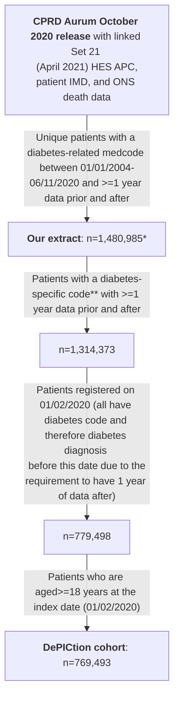
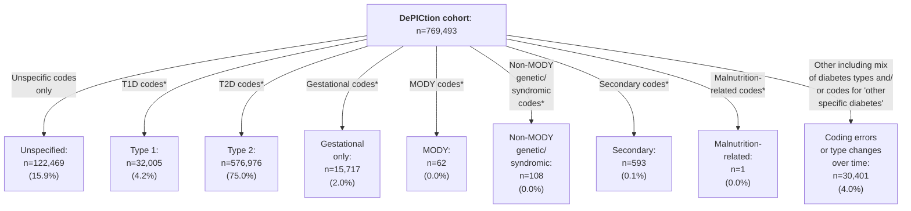

# Initial data quality exploration

## Introduction

The scripts in this directory used a cohort of adults with diabetes registered in primary care on 01/02/2020 to explore data quality issues, particularly around diabetes type coding and diagnosis dates, and determine rules to identify those with poor quality data. The below diagram shows the contruction of this cohort:



\* Extract (see upper level of repository for full details) actually contained n=1,481,294 unique patients (1,481,884 in total but some duplicates) but included n=309 with registration start dates in 2020 (which did not fulfil the extract criteria of having a diabetes-related medcode between 01/01/2004-06/11/2020 and >=1 year of data after this; some of these were also not 'acceptable' by [CPRD's definition](https://cprd.com/sites/default/files/2023-02/CPRD%20Aurum%20Glossary%20Terms%20v2.pdf)). NB: removing those with registration start date in 2020 also removed all of those with a 'patienttypeid' not equal to 3 ('regular'). See next section for further details on the extract.

\** The list of diabetes-related medcode used for the extract (see below) included some which were not specific to diabetes e.g. 'insulin resistance' and 'seen in diabetes clinic***'. The list of 'diabetes-specific codes' used to define the cohort here can be found in our [CPRD-Codelists respository](https://github.com/Exeter-Diabetes/CPRD-Codelists/blob/main/Diabetes/exeter_medcodelist_all_diabetes.txt).

\***  We determined the code 'Seen in diabetes clinic' (medcode 285223014) to be unspecific to diabetes after observing a large number of patients (>100,000) in our extract with this code and no further evidence of diabetes such as other codes for diabetes, high HbA1c test results, or prescriptions for glucose-lowering medications.

&nbsp;

## Scripts

See upper level of this repository for notes on the aurum package and codelists used in these scripts.

&nbsp;

### 01_dpctn_cohort
Defines the cohort as per the flowchart above, and adds in patient characteristics (e.g. sex, ethnicity, age at index date) as well as biomarkers values at/prior to index date (BMI, HDL, triglycerides, total cholesterol, HbA1c, GAD/IA2 antibodies, and C-peptide) and family history of diabetes.

&nbsp;

### 02_dpctn_diabetes_type_all_time
Uses diabetes type codes to define diabetes type as per the below flowchart:



\* Could also have diabetes codes of unspecified type. For gestational diabetes only: earliest and latest codes for unspecified diabetes must be no more than a year prior to earliest gestational diabetes code (excluding 'history of gestational diabetes' codes) and no more than a year after latest gestational diabetes code (excluding 'history of gestational diabetes' codes).

\** All gestational diabetes codes (excluding 'history of gestational diabetes' codes) must be earlier than the earliest Type 2 diabetes code.

&nbsp;

This script also looks at how many diabetes codes, high HbA1cs and scripts for glucose-lowering medication have dates before the patient's birth (and so need to be cleaned). For all code categories, and all high HbA1cs and OHA/insulin scripts, >99.9% were on/after the patient's DOB (and only ~0.3% of cohort (1,994/769,493) are affected). The small proportion of codes/high HbA1c/scripts before DOB were excluded from downstream analysis.

&nbsp;

### 03_dpctn_diabetes_qof_primis_codelist
Looks at effect of restricting the cohort to those with a diabetes QOF code / medcode which maps to SNOMED code in pre-existing PRIMIS diabetes codelist (https://www.opencodelists.org/codelist/primis-covid19-vacc-uptake/diab/v.1.5.3/).

&nbsp;

Diabetes QOF codes: the QOF codelist was constructed from Read codes from version 38 and SNOMED codes from version 44 of the QOF, which include all codes from previous versions. Have only included medcodes which map to Read codes from version 38 and SNOMED codes from version 44 - i.e. haven't mapped between SNOMED and Read codes. Includes some codes for non-Type 1/Type 2 types of diabetes, but not gestational (or malnutrition). Not sure about QOF usage 2020 onwards (doesn't affect this dataset).

Number in each class with QOF code:
* Unspecified: 3,674/122,469 (3.0%)
* Type 1: 31,914/32,005 (99.7%)
* Type 2: 574,893/576,976 (99.6%)
* Gestational only: 169/15,717 (1.1%)
* MODY: 62/62 (100.0%)
* Non-MODY genetic/syndromic: 87/108 (80.6%)
* Secondary: 143/593 (24.1%)
* Malnutrition: 1/1 (100.0%)
* Other: 30,316/30,401 (99.7%)

Median time between most recent QOF code and index date:
* Unspecified: 549 days
* Type 1: 319 days
* Type 2: 292 days
* Gestational only: 1,016 days
* MODY: 666 days
* Non-MODY genetic/syndromic: 493 days
* Secondary: 502 days
* Malnutrition: 458 days
* Other: 262 days

&nbsp;

PRIMIS diabetes codelist: contains 545 SNOMED codes; 187 are in 05/2020 CPRD Medical Dictionary and match to 753 medcodes (NB: numbers are much higher (458 SNOMED codes matching to 1,415 medcodes) if use more recent medical dictionary BUT none of the new codes are in our download).

Our diabetes codelist (including all types of diabetes) is 1,361 medcodes. 711 of PRIMIS medcodes are in this list, but PRIMIS contains extra 42 medcodes - most are infrequently used ^ESCT codes but these aren't:

CPRD Term description                                     Original Read code
1 O/E - right eye clinically significant macular oedema   2BBm            
2 O/E - left eye clinically significant macular oedema    2BBn            
3 Loss of hypoglycaemic warning                           66AJ2           
4 Hypoglycaemic warning absent                            66AJ4           
5 Insulin autoimmune syndrome                             C10J            
6 Insulin autoimmune syndrome without complication        C10J0           
7 Achard - Thiers syndrome                                C152-1          
8 Leprechaunism                                           C1zy3           
9 Donohue's syndrome                                      C1zy3-1         
10 Mauriac's syndrome                                     EMISNQMA111     
11 Ballinger-Wallace syndrome                             ESCTDI21-1      
12 HHS - Hyperosmolar hyperglycaemic syndrome             ESCTDI23-1      
13 HHS - Hyperosmolar hyperglycemic syndrome              ESCTDI23-2      
14 Rogers syndrome                                        ESCTME15-1      
15 Herrmann syndrome                                      ESCTPH1-1       
16 Kimmelstiel - Wilson disease                           K01x1-1

In PRIMIS codelist, some the term descriptions for these codes contain 'diabetes mellitus' but don't in the CPRD Medical Dictionary. We can't really investigate whether these codes would pick up more people than our codelist as our extract relied on our codelist (although could look in full download).

Number in each category with any of the 753 PRIMIS medcodes:
* Unspecified: 9,655/122,469 (7.9%)
* Type 1: 31,996/32,005 (100.0%)
* Type 2: 576,234/576,976 (99.9%)
* Gestational only: 397/15,717 (2.5%)
* MODY: 62/62 (100.0%)
* Non-MODY genetic/syndromic: 87/108 (80.6%)
* Secondary: 593/593 (100.0%)
* Malnutrition: 1/1 (100.0%)
* Other: 30,384/30,401 (99.9%)

&nbsp;

The top diabetes medcodes (from our codelist of 1,361) most frequently used by those in the 'unspecified' group are as below:
* 19,477 (15.9%) have 285223014 **'Seen in diabetic clinic'** (note that patients had to have additional diabetes codes to this to appear in the DePICtion cohort - see note above)
* (16,630 (13.6%) have a high HbA1c measurement)
* 12,208 (10.0%) have 216201011 'Diabetic retinopathy screening'
* 11,638 (9.5%) have 616731000006114 **'Diabetes monitoring first letter'**
* 9,310 (7.6%) have 264676010 **'Diabetic monitoring'**
* 9180 (7.5%) have 1488393013 'O/E - Right diabetic foot at low risk'
* 9,146 (7.5%) have 1488397014 'O/E - Left diabetic foot at low risk'
* 9,146 (7.5%) have 2533110014 **'Referral to diabetes structured education programme'**
* (8,841 (7.2%) have OHA script)
* 8,047 (6.6%) have 200111000006116 **'Diabetes mellitus diet education'**
Next most popular are 'Diabetic annual review' and 'Seen in diabetic eye clinic' codes

If we look in the 92.1% (112,814) without a PRIMIS diabetes code, the top diabetes medcodes are:
* 16,810 (14.9%) have 285223014 **'Seen in diabetic clinic'**
* (12,000 (10.6%) have a high HbA1c measurement)
* 8,965 (7.9%) have 616731000006114 **'Diabetes monitoring first letter'**
* 8,255 (7.3%) have 216201011 'Diabetic retinopathy screening'
* 7,489 (6.6%) have 2533110014 **'Referral to diabetes structured education programme'**
* 7,470 (6.6%) have 200111000006116 **'Diabetes mellitus diet education'**
* (6,021 (5.3%) have OHA script)		
* 5,984 (5.3%) have 264676010 **'Diabetic monitoring'**
* 5,541 (4.9%) have 21631000000117 **'Diabetes monitoring administration'**
* 5,223 (4.6%) have 546471000000114 **'Diabetes structured education programme declined'**
* 5,124 (4.5%) have 616741000006116 **'Diabetes monitoring second letter'**
* 4,630 (4.1%) have 457231013 'Seen in diabetic eye clinic'

59,974/112,814 (53.2%) of those without a PRIMIS diabetes code have a single diabetes medcode only (and no high HbA1c measurements or OHA/insulin scripts). Their top medcodes are:
* 4,156 (6.9%) have 616731000006114 **'Diabetes monitoring first letter'**
* 4,151 (6.9%) have 216201011 'Diabetic retinopathy screening'
* 4,118 (6.9%) have 200111000006116 **'Diabetes mellitus diet education'**
* 3,926 (6.5%) have 2533110014 **'Referral to diabetes structured education programme'**
* 3,831 (6.4%) have 616741000006116 **'Diabetes monitoring second letter'**
* 3,235 (5.4%) have 546471000000114 **'Diabetes structured education programme declined'**
* 2,682 (4.5%) have 21631000000117 **'Diabetes monitoring administration'**
* 2,397 (4.0%) have 264676010 **'Diabetic monitoring'**
* 2,328 (3.9%) have 457231013 'Seen in diabetic eye clinic'
* 2,092 (3.5%) have 283027015 **'Diabetic leaflet given'**
* 1,906 (3.2%) have 1946701000006110 **'Provision of written information about diabetes and high haemoglobin A1c level'**

Bolded codes look like they may be used in those without diabetes.

```diff
- Rule 1: For those with no diabetes type-specific codes, clinicians need to investigate what type of diabetes (if any) the patient has been diagnosed with. The number of people with this issue depends on the codelist used to identify those with diabetes; it seems likely that some codes which appear to be diabetes-specific are also used in those without diabetes.
```

&nbsp;

### 04_dpctn_diabetes_diagnosis_dates
Looks at potential quality issues around diagnosis dates (diabetes codes in year of birth) and determines diagnosis date for patients in the cohort (earliest of diabetes code, high HbA1c or script for glucose-lowering medication). Also looks at implications of using diabetes codes only to determine diagnosis dates.

Patients with diabetes type 'other' (as per flowchart above) were excluded (are later analysed in script 05_dpctn_diabetes_type_over_time) as they may have changes in their diagnosed type of diabetes over time. For the remaining cohort, diagnosis date is determined as the earliest diabetes code, high HbA1c or script for glucose-lowering medication. 

To investigate data quality issues, date of diagnosis by calendar year relative to year of birth was analysed:


Clearly there are data quality issues since we would not expect any patients with Type 2 diabetes to be diagnosed in their year of birth. Subsequent analysis ignored diabetes codes in the year of birth for those with Type 2 diabetes, using the next code/high HbA1c/prescription for glucose-lowering medication. This constitutes only 0.3% of those with Type 2 diabetes.

#### Rule 2: Clinicians should check diabetes diagnoses before or in the year of birth, especially for those with Type 2 diabetes, although this is expected to affect <1% of the cohort. Diagnoses which are incorrectly coded as being in/before the year of birth will reduce the age of diagnosis compared to the actual value, and therefore increase the probability of having MODY in the MODY calculator, or of having Type 1 diabetes in the T1DT2D calculator. Clinicians can therefore just look at individuals with diagnoses in the year of birth who are diagnosed with Type 1 or Type 2 diabetes and have been flagged as being high MODY risk, or with Type 2 who have been flagged as having high Type 1 diabetes risk. 

&nbsp;

Also to investigate data quality issues, date of diagnosis by calendar year relative to year of registration start was analysed:


To look at this in further detail, we then plotted diagnosis by week relative to registration start:


And looked at the time between diagnosis and first OHA/insulin script by week of diagnosis relative to registration start:


Again, clearly there are data quality issues with more patients than expected being diagnosed close to when they register with their primary care practice (primarily after but some shortly before). This probably reflects old diagnoses (prior to registration) being recorded as if they were new, and hence the shorter time to first OHA/insulin script for those diagnosed closer to registration. In previous work ([https://bmjopen.bmj.com/content/7/10/e017989](https://bmjopen.bmj.com/content/7/10/e017989)) we removed diagnoses within 3 months (<91 days) of registration start are excluded as per [https://bmjopen.bmj.com/content/7/10/e017989](https://bmjopen.bmj.com/content/7/10/e017989), but using the above plot we have decided to extend this window to -2 to +4 months.

#### Rule 3: Clinicians should check diabetes diagnoses -61 to +122 days (-2 to +4 months) relative to registration start (expected to affect ~5% of cohort)

&nbsp;

The table below shows which out of a diagnosis code, high HbA1c, or prescription for glucose-lowering medication occurred earliest for patients and was therefore used as the date of diagnosis (after codes in the year of birth were removed for those with Type 2 diabetes). 'Missing' indicates patients with a diagnosis within 3 months (<91 days) of registration start. If patients had >1 of a diabetes code, high HbA1c and/or prescription for OHA/insulin on their date of diagnosis, only the highest ranking of these is shown in the table (rank order: diabetes code > high HbA1c > precription for OHA > prescription for insulin). Note that all HbA1cs prior to 1990 were exclude due to data quality concerns as HbA1c wasn't widely used at this time.

| Diabetes type (as per flowchart above) | Diabetes code for unspecified type | Diabetes code for specific type | Unspecified and/or type-specific diabetes code | High HbA1c | OHA prescription | Insulin prescription | Missing |
| ---- | ---- | ---- | ---- | ---- | ---- | ---- | ---- |
| Any type* (n=747931) | 272842 (36.5%) | 206309 (27.6%) | 479151 (64.1%) | 222700 (29.8%) | 16774 (2.2%) | 1695 (0.2%) | 27611 (3.7%) |
| Unspecified (n=122469) | 108837 (88.9%) |  0 (0.0%) | 108837 (88.9%) | 8431 (6.9%) | 3287 (2.7%) | 176 (0.1%) | 1738 (1.4%) |
| Type 1 (n=32005) | 11318 (35.4%) | 16875 (52.7%) | 28193 (88.1%) | 1574 (4.9%) | 189 (0.6%) | 753 (2.4%) | 1296 (4.0%) |
| Type 2 (n=576976) | 144634 (25.1%) | 182636 (31.7%) | 327270 (56.7%) | 212396 (36.8%) | 12414 (2.2%) | 642 (0.1%) | 24254 (4.2%) |
| Gestational only (n=15717) | 7892 (50.2%) | 6496 (41.3%) | 14388 (91.5%) | 72 (0.5%) | 849 (5.4%) | 100 (0.6%) | 308 (2.0%) |
| MODY (n=62) | 12 (19.4%) | 28 (45.2%) | 40 (64.5%) | 15 (24.2%) | 2 (3.2%) | 1 (1.6%) | 4 (6.5%) |
| Non-MODY genetic/syndromic (n=108) | 34 (31.5%) | 52 (48.1%) | 86 (79.6%) | 6 (5.6%) | 5 (4.6%) | 7 (6.5%) | 4 (3.7%) |
| Secondary (n=593) | 114 (19.2%) | 222 (37.4%) | 336 (56.7%) | 206 (34.7%) | 28 (4.7%) | 16 (2.7%) | 7 (1.2%) |
| Malnutrition (n=1) | 1 (100.0%) | 0 (0.0%) | 1 (100.0%) | 0 (0.0%) | 0 (0.0%) | 0 (0.0%) | 0 (0.0%) |

\* Excluding 'other'

&nbsp;

The table below shows what the impact would be of using diabetes code (unspecified type and type-specific) alone to determine diagnosis dates (i.e. not also using high HbA1c and prescriptions for glucose-lowering medication).

| Diabetes type (as per flowchart above) | Median difference in diagnosis date if only diabetes codes used (days) | Median difference in diagnosis date if only diabetes codes used (days) in patients with a high HbA1c/prescription for glucose-lowering medication earlier than a diabetes code |
| ---- | ---- | ---- |
| Any type* (n=719027 with non-missing diagnosis date) | 0 | 26 |
| Unspecified (n=120679 with non-missing diagnosis date) | 0 | 282 |
| Type 1 (n=30664 with non-missing diagnosis date) | 0 | 7 |
| Type 2 (n=551530 with non-missing diagnosis date)| 0 | 24 |
| Gestational only (n=15407 with non-missing diagnosis date) | 0 | 552 |
| MODY (n=57 with non-missing diagnosis date) | 0 | 251 |
| Non-MODY genetic/syndromic (n=104 with non-missing diagnosis date) | 0 | 422 |
| Secondary (n=585 with non-missing diagnosis date) | 0 | 31 |
| Malnutrition (n=1 with non-missing diagnosis date) | 0 | NA |

&nbsp;

### 05_dpctn_diabetes_type_over_time
Looks at patients with codes for >1 type of diabetes (n=30,401; classified as 'other' as per above flowchart) to determine diagnosis dates and when changes in diagnosis occurred.

These are the most popular combinations of diabetes type codes in this group:
* 18,710 (61.5%) Type 1 and Type 2
* 8,704 (28.6%) Type 2 and gestational
* 1,326 (4.4%) Type 2 and secondary
* 352 (1.2%) Type 1 and gestational
* 342 (1.1%) Type 1, Type 2 and gestational
Together these account for 96.9% of those with codes for >1 type of diabetes; all remaining combinations are <1% each.

To do: determine diagnosis dates for most populous groups (T1/T2 and T2/gestational) and when diagnosis changed (or whether codes of second diabetes type are likely to be a mistake).

Also finds age at diagnosis and time to insulin initiation from diagnosis to all those with codes for 1 type of diabetes, and those for with codes for both T1/T2 or both T2/gestational.

&nbsp;

### 06_dpctn_diabetes_type_issues
**NB: The MODY and T1D/T2D calculators are only intended for those diagnosed <=50 years of age (MODY: aged 1-35; T1D/T2D: aged 18-50, both inclusive), so in this script, only those diagnosed <50 years of age were included.**

Looks at potential miscoding/misclassification of diabetes/diabetes type, including:
* Those coded as Type 1:
    * With no prescriptions for insulin (could look further at type of insulin e.g. must have basal and bolus; for NDA they exclude from Type 1 if long-acting insulin only)
    * With insulin but also taking an OHA other than metformin/SGLT2-inhibitor (as per NDA)
    * With more than 3 years between diagnosis and initiating insulin treatment
* Those coded as Type 2:
    * With less than 6 months between diagnosis and initiating insulin treatment
    * With no OHA prescriptions prior to insulin initiation
    * With no OHA/insulin prescriptions or high HbA1c measurements
* Those coded as gestational only:
    * With unspecified diabetes codes >1 prior to earliest / >1 year after latest gestational diabetes code (excluding history of gestational diabetes), implying possible Type 1/2 diabetes
(All to do + can compare frequencies to de Luisignan paper)

Other data issues flagged by previous scripts:
* Those with no type-specific diabetes codes (n=122,814 or 15.8% of the cohrot as per above flowchart)
* Potential issue with diagnosis dates explored in script 03_dpctn_diabetes_diagnosis_dates

&nbsp;

### 07_dpctn_mody_calculator
Defines MODY calculator cohort: those with current diagnosis of Type 1, Type 2, or unspecified diabetes, diagnosed aged 1-35 years inclusive.

**Not done yet: exploring whether separate weight/height measurements could help with missing BMI**

&nbsp;

Cohort characteristics:
| Characteristic |  Class: Type 1 |  Class: Type 2 | Class: Unspecified | Class: Type 1/Type 2 | Class: Type 2/gestational |
| ---- | ---- | ---- | ---- | ---- | ---- |
| N | 24946 | 26379 | 12646 |||
| Median (IQR) age at diagnosis (years) | 16.2 (13.8) | 30.9 (6.2) | 27.0 (10.7) |||
| Median (IQR) current age (years) | 39.6 (23.0) | 42.9 (14.0) | 32.6 (10.9) |||
| Median (IQR) BMI within 2 years (kg/m2) | 26.2 (6.7) | 32.0 (10.1) | 28.5 (10.6) |||
| Missing BMI within 2 years | 4256 (17.06%) | 2920 (11.07%) | 7303 (57.75%) |||
| Median (IQR) time from BMI within 2 years to index date (days) | 184.0 (258.0) | 164.0 (231.0) | 242.0 (322.0) |||
| Median (IQR) BMI any time >=diagnosis (kg/m2) | 26.0 (6.6) | 32.0 (10.0) | 28.0 (10.3) |||
| Missing BMI >=diagnosis | 441 (1.77%) | 391 (1.48%) | 5215 (41.24%) |||
| Median (IQR) time from BMI any time >=diagnosis to index date (days) | 232.0 (398.0) | 187.0 (287.0) | 380.0 (795.0) |||
| Median (IQR) HbA1c within 2 years (mmol/mol) | 66.0 (21.1) | 61.9 (29.0) | 37.0 (8.0) |||
| Missing (IQR) HbA1c within 2 years | 1756 (7.04%) | 1434 (5.44%) | 8083 (63.92%) |||
| Median time from HbA1c within 2 years to index date (days) | 151.0 (212.0) | 131.0 (176.0) | 263.0 (314.0) |||
| Median (IQR)  HbA1c any time >=diagnosis (mmol/mol) | 67.0 (22.0) | 61.9 (29.1) | 36.0 (6.8) |||
| Missing HbA1c >=diagnosis | 180 (0.72%) | 115 (0.44%) | 6961 (55.05%) |||
| Median (IQR) time from HbA1c any time >=diagnosis to index date (days) | 165.0 (250.0) | 141.0 (207.0) | 353.0 (606.0) |||
| With negative family history of diabetes | 2024 (8.11%) | 1933 (7.33%) | 1074 (8.49%) |||
| With positive family history of diabetes | 5845 (23.43%) | 11765 (44.60%) | 2492 (19.71%) |||
| Missing family history of diabetes | 17077 (68.46%) | 12681 (48.07%) | 9080 (71.80%) |||
| Not on insulin <= 6 months after diagnosis | 2220 (8.90%) | 20382 (77.27%) | 12349 (97.65%) |||
| On insulin <= 6 months after diagnosis | 5879 (23.57%) | 736 (2.79%) | 158 (1.25%) |||
| Missing whether on insulin <= 6 months after diagnosis | 16847 (67.53%) | 5261 (19.94%) | 139 (1.10%) |||
| On OHA or ins (script in last 6 months) | 24021 (96.29%) | 22040 (83.55%) | 529 (4.18%) ||| 
| Missing any variable required for MODY calculator if use BMI and HbA1c back to diagnosis | 23266 (93.27%) | 15779 (59.81%) | 10913 (86.30%)|||

&nbsp;

Characteristics of those with no missing MODY calculator variables:
| Characteristic | Class: Unspecified |  Class: Type 1 |  Class: Type 2 | Class: Type 1/Type 2 | Class: Type 2/gestational |
| ---- | ---- | ---- | ---- | ---- | ---- |
| N | 1680 | 10600 | 1733
| Median age at diagnosis | 23.1 (15.3) | 31.3 (5.7) | 30.1 (7.4) |||
| Median (IQR) current age (years | 36.6 (19.0) | 41.6 (11.0) | 36.6 (9.0) |||
| Median BMI any time >=diagnosis | 26.2 (6.8) | 31.9 (9.9) | 30.2 (10.8) |||
| Median HbA1c any time >=diagnosis | 69.0 (25.0) | 59.0 (27.5) | 37.7 (8.0) |||
| With negative family history of diabetes | 493 (29.35%) | 1566 (14.77%) | 456 (26.31%) |||
| With positive family history of diabetes | 1187 (70.65%) | 9034 (85.23%) | 1277 (73.69%) |||
| Not on insulin <= 6 months after diagnosis | 550 (32.74%) | 10291 (97.08%) | 1696 (97.86%) |||
| On insulin <= 6 months after diagnosis | 1130 (67.26%) | 309 (2.92%) | 37 (2.14%) |||
| On OHA or ins (script in last 6 months) | 1613 (96.01%) | 8651 (81.61%) | 137 (7.91%) |||

&nbsp;

Adjusted MODY probabilities for complete cases:


&nbsp;

### 08_dpctn_t1dt2d_calculator
Defines T1DT2D calculator cohort: those with current diagnosis of Type 1, Type 2, or unspecified diabetes, diagnosed aged 18-50 years inclusive.

**Not done yet: exploring whether separate weight/height measurements could help with missing BMI**

&nbsp;

Cohort characteristics:
| Characteristic |  Class: Type 1 |  Class: Type 2 | Class: Unspecified | Class: Type 1/Type 2 | Class: Type 2/gestational |
| ---- | ---- | ---- | ---- | ---- | ---- |
| N | 14887 | 167485 | 32609 |||
| Median (IQR) age at diagnosis (years) | 28.5 (12.8) | 43.5 (8.7) | 40.3 (13.4) |||
| Median (IQR) current age (years | 49.6 (20.7) | 53.8 (12.0) | 45.6 (13.0) |||
| Median (IQR) BMI within 2 years (kg/m2) | 26.5 (6.5) | 31.2 (8.7) | 29.7 (9.4) |||
| Missing BMI within 2 years | 2242 (15.06%) | 14944 (8.92%) | 15710 (48.18%) |||
| Median (IQR) time from BMI within 2 years to index date (days) | 178.0 (249.0) | 158.0 (222.0) | 242.0 (316.0) |||
| Median (IQR) BMI any time >=diagnosis (kg/m2) | 26.4 (6.5) | 31.2 (8.8) | 29.1 (9.1) |||
| Missing BMI >=diagnosis | 273 (1.83%) | 1970 (1.18%) | 10263 (31.47%) |||
| Median (IQR) time from BMI any time >=diagnosis to index date (days) | 215.0 (355.0) | 178.0 (262.0) | 358.0 (715.0) |||
| Median (IQR) total cholesterol within 2 years (mmol/L) | 4.4 (1.3) | 4.2 (1.4) | 4.9 (1.3) |||
| Missing total cholesterol within 2 years | 1284 (8.62%) | 7150 (4.27%) | 16455 (50.46%) |||
| Median (IQR) time from total cholesterol within 2 years to index date (days) | 182.0 (231.0) | 165.0 (194.0) | 256.0 (305.0) |||
| Median (IQR) total cholesterol any time >=diagnosis (mmol/L) | 4.4 (1.3) | 4.2 (1.5) | 4.9 (1.4) |||
| Missing total cholesterol >=diagnosis | 229 (1.54%) | 967 (0.58%) | 12848 (39.40%) |||
| Median (IQR) time from total cholesterol any time >=diagnosis to index date (days) | 199.0 (262.0) | 172.0 (207.0) | 340.0 (623.0) |||
| Median (IQR) HDL within 2 years (mmol/L) | 1.5 (0.6) | 1.1 (0.4) | 1.3 (0.4) |||
| Missing HDL within 2 years | 2054 (13.80%) | 11539 (6.89%) | 16919 (51.88%) |||
| Median (IQR) time from HDL within 2 years to index date (days) | 190.0 (244.0) | 171.0 (198.0) | 260.0 (304.0) |||
| Median (IQR) HDL any time >=diagnosis (mmol/L)| 1.5 (0.6) | 1.1 (0.4) | 1.3 (0.5) |||
| Missing HDL >=diagnosis | 423 (2.84%) | 1880 (1.12%) | 13313(40.83%) |||
| Median (IQR) time from HDL any time >=diagnosis to index date (days) | 219.0 (313.0) | 183.0 (225.0) | 346.0 (637.2 |||
| Median (IQR) triglyceride within 2 years (mmol/L) | 1.1 (0.8) | 1.7 (1.3) | 1.4 (1.1) |||
| Missing triglyceride within 2 years | 5462 (36.69%) | 48337 (28.86%) | 20386 (62.52%) |||
| Median (IQR) time from triglyceride within 2 years to index date (days) | 208.0 (263.0) | 190.0 (227.0) | 270.0 (311.5) |||
| Median (IQR) triglyceride any time >=diagnosis (mmol/L) | 1.1 (0.8) | 1.7 (1.3) | 1.4 (1.1) |||
| Missing triglyceride >=diagnosis | 1531 (10.28%) | 11115 (6.64%) | 16128 (49.46%) |||
| Median (IQR) time from triglyceride any time >=diagnosis to index date (days) | 337.0 (802.0) | 261.0 (570.0) | 416.0 (839.0) |||
| Missing any variable required for MODY calculator if use biomarkers back to diagnosis | 1693 (11.37%) | 12588 (7.52%) | 18342 (56.25%) |||

&nbsp;

Number with measured GAD and/or IA2 antibodies is very small:
* GAD: 127 (0.9%) of Type 1, 431 (0.03%) of Type 2, 35 (0.1%) of unspecified
* IA2: 4 (0.03%) of Type 1, 9 (0.005%) of Type 2, 0 (0.0%) of unspecified

&nbsp;

T1D probability using age and BMI only:


&nbsp;

T1D probability using age, BMI and lipids:


&nbsp;

### Other bits discussed and not implemented:
* Working out whether patients (especially those with Type 1) are being treated in secondary care (and that's why we have missing info)
* Further work on those without any type-specific codes to remove those without diabetes
* Integrating other features which might aid classification:
    * At diagnosis:
        * Polydipsia
        * Ketones
        * Glucose
        * Capillary glucose
        * Weight loss
        * DKA
    * And longitudinally:
        * C-peptide
        * Islet Abs
        * Autoimmune tests e.g. thyroid function, TTG (coeliac) - Lancet paper
        * Type changing over time
        * Referral to endo?
* Later: outcomes affected by misclassification including infection
* Checking small % with remission codes - compare to 2x papers and possibly UKBB
