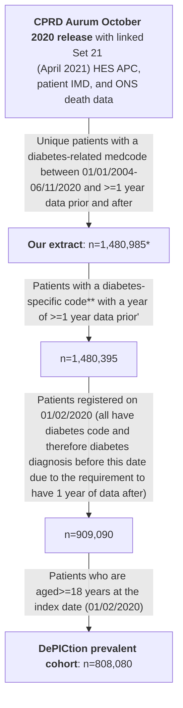

# CPRD-Katie-DePICtion-Scripts

### Introduction

This repository contains the R scripts used to implement the Exeter Diabetes MODY calculator and T1D/T2D calculator in a CPRD Aurum dataset as part of the DePICtion project. Our [CPRD-Cohort-scripts respository](https://github.com/Exeter-Diabetes/CPRD-Cohort-scripts) has similar scripts for defining different cohorts in this same dataset.

The below diagram outlines the data processing steps involved in creating a cohort of adults with diabetes registered in primary care on 01/02/2020 which was used for this work:

\* Extract actually contained n=1,481,294 unique patients (1,481,884 in total but some duplicates) but included n=309 with registration start dates in 2020 (which did not fulfil the extract criteria of having a diabetes-related medcode between 01/01/2004-06/11/2020 and >=1 year of data after this; some of these were also not 'acceptable' by [CPRD's definition](https://cprd.com/sites/default/files/2023-02/CPRD%20Aurum%20Glossary%20Terms%20v2.pdf)). NB: removing those with registration start date in 2020 also removed all of those with a 'patienttypeid' not equal to 3 ('regular'). See next section for further details on the extract.

&nbsp;

\** The list of diabetes-related medcode used for the extract (see below) included some which were not specific to diabetes e.g. 'insulin resistance'. The list of 'diabetes-specific codes' used to define the cohort here can be found in our [CPRD-Codelists respository](https://github.com/Exeter-Diabetes/CPRD-Codelists/blob/main/Diabetes/exeter_medcodelist_all_diabetes.txt).

&nbsp;

## Extract details
Patients with a diabetes-related medcode ([full list here](https://github.com/Exeter-Diabetes/CPRD-Katie-MASTERMIND-Scripts/blob/main/Extract-details/diab_med_codes_2020.txt)) in the Observation table were extracted from the October 2020 CPRD Aurum release. See below for full inclusion criteria:

&nbsp;

&nbsp;

## Script overview

&nbsp;

## Script details

Data from CPRD was provided as raw text files which were imported into a MySQL database using a custom-built package ([aurum](https://github.com/Exeter-Diabetes/CPRD-analysis-package)) built by Dr Robert Challen. This package also includes functions to allow easy querying of the MySQL tables from R, using the 'dbplyr' tidyverse package. Codelists used for querying the data (denoted as 'codes${codelist_name}' in scripts) can be found in our [CPRD-Codelists repository](https://github.com/Exeter-Diabetes/CPRD-Codelists). 

Our [CPRD-Codelists repository](https://github.com/Exeter-Diabetes/CPRD-Codelists) also contains more details on the algorithms used to define variables such as ethnicity and diabetes type - see individual scripts for links to the appropriate part of the CPRD-Codelists repository.

| Script description | &nbsp;&nbsp;&nbsp;&nbsp;&nbsp;&nbsp;&nbsp;&nbsp;&nbsp;&nbsp;&nbsp;&nbsp;&nbsp;&nbsp;&nbsp;&nbsp;&nbsp;&nbsp;&nbsp;&nbsp;&nbsp;&nbsp;&nbsp;&nbsp;&nbsp;&nbsp;&nbsp;&nbsp;&nbsp;&nbsp;&nbsp;&nbsp;&nbsp;&nbsp;Outputs&nbsp;&nbsp;&nbsp;&nbsp;&nbsp;&nbsp;&nbsp;&nbsp;&nbsp;&nbsp;&nbsp;&nbsp;&nbsp;&nbsp;&nbsp;&nbsp;&nbsp;&nbsp;&nbsp;&nbsp;&nbsp;&nbsp;&nbsp;&nbsp;&nbsp;&nbsp;&nbsp;&nbsp;&nbsp;&nbsp;&nbsp;&nbsp;&nbsp;&nbsp; |
| ---- | ---- |
| | |

&nbsp;
