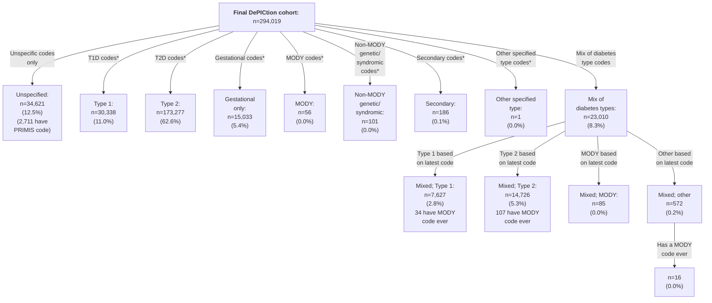
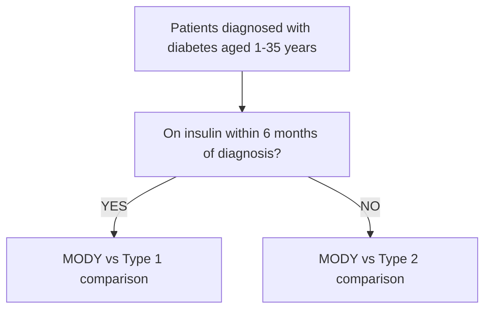
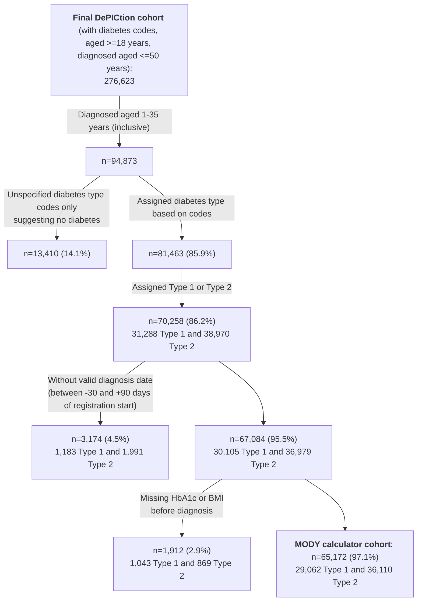
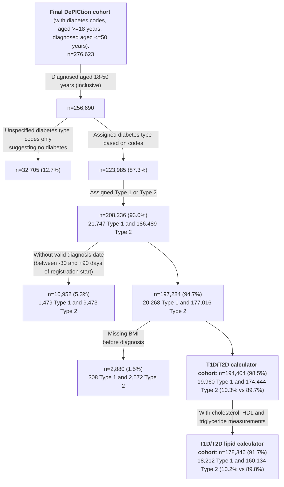

# CPRD-Katie-DePICtion-Scripts

## Introduction

This repository contains the R scripts used to implement the Exeter Diabetes MODY calculator and T1D/T2D calculator in a CPRD Aurum dataset as part of the DePICtion project. Our [CPRD-Cohort-scripts respository](https://github.com/Exeter-Diabetes/CPRD-Cohort-scripts) has similar scripts for defining different cohorts in this same dataset.

&nbsp;

## Rules for data handling

As a result of the work in the 'Initial data quality exploration' directory in this repository, a number of rules for implementing these calculators and dealing with data quality issues were decided upon. These aim to be pragmatic (easily implemented) so that the MODY and T1D/T2D calculators can easily be run in primary care data, whilst excluding as few patients as possible due to e.g. missing data issues. These calculators aim to identify those whose diabetes type is misclassified: i.e. those with a Type 1 or Type 2 diabetes diagnosis who may have MODY, those with a Type 1 diagnosis who may actually have Type 2, and those with a Type 2 diagnosis who may actually have Type 1. The rules aim to minimise the chance of missing these misclassified cases.

&nbsp;

| Rule purpose | &nbsp;&nbsp;&nbsp;&nbsp;&nbsp;&nbsp;&nbsp;&nbsp;Details&nbsp;&nbsp;&nbsp;&nbsp;&nbsp;&nbsp;&nbsp;&nbsp; | Rationale and expected effect | How this is dealt with in our analysis |
| --- | --- | --- | --- |
| Cohort definition | Cohort is everybody with a code for diabetes (with a current diagnosis of Type 1 or Type 2 diabetes diagnosed <=50 years of age) | This high-sensitivity approach means we include everybody with diabetes, reducing bias which may arise from excluding those with poor quality coding i.e. those who don't have elevated HbA1c measurements in their records. Depending on the codelist used, we may include some people without diabetes who then need to be removed as they will end up with high MODY probabilities. | We have used a very broad codelist, but this identified a large number of individuals with no diabetes type-specific codes who we have not been able to run the calculators on |
| Diabetes type | Diabetes type is determined by codes i.e. if a person has codes for Type 2 diabetes, they are defined as Type 2. If they have codes for multiple types of diabetes, the most recent code is used. If they have no type-specific codes then the clinician needs to check this; the proportion of people with no type-specific codes will vary with the codelist used to define the cohort. | Most recent code is used as their diagnosis may have changed over time. In addition, using most recent code matched the 'gold standard' diagnosis (based on code frequencies - see https://www.jclinepi.com/article/S0895-4356(22)00272-4/fulltext) in 77% of cases for a cohort with both Type 1 and Type 2 codes - see Initial data quality exploration (NB: to be more certain of current diagnosis, those with codes for >1 type of diabetes in the last 5 years can be investigated further). NB: we found that 25% of our gestational diabetes cohort had codes for diabetes (of no specific type) more than 1 year before earliest gestational code or more than 1 year after latest gestational code (excluding 'history of gestational diabetes' codes), suggesting they may have Type 1 or Type 2; we have not applied the calculators to these people | We have implemented these rules, but have only applied the calculators to those with a current diagnosis of Type 1 or Type 2 diabetes (see below flowchart). Note that for those with codes for gestational diabetes and another type of diabetes, we used the most recent non-gestational code to determine diabetes type (as these other types are not temporary, unlike gestational diabetes). This adds ~1% to the mixed; Type 2 diabetes group and ~0.2% to the mixed; Type 1 group. |
| Diabetes diagnosis date 1 | Diagnosis date is determined as the earliest code for diabetes, excluding those before the date of birth | There is a minimal time difference (see Initial data quality exploration) if the earliest of a code, an elevated HbA1c, or an OHA/insulin script is used instead | We have implemented this rule |
| Diabetes diagnosis date 2 | Those with diagnoses in their year of birth should be investigated further | We found an excess of diabetes codes in the year of birth compared to later years (<1% of our cohort, see Initial data quality exploration), suggesting miscoding. Patients with this issue should be investigated, especially those with Type 1, those with Type 2 who have a high probability of Type 1 from the T1D/T2D calculator, and those with a high MODY probability (as the effect of this issue is to incorrectly lower the age of diagnosis). | For those with Type 2 (and no codes for other types of diabetes), we have ignored diabetes codes in the year of birth |
| Diabetes diagnosis date 3 | Those with diagnoses between -30 and +90 days (inclusive) of registration start should be investigated further | We found an excess of diabetes codes around registration start (4% of our cohort, see Initial data quality exploration),  (compared to later years; see Initial data quality exploration), probably reflecting old diagnoses (prior to registration) being recorded as if they were new. Patients with this issue should be investigated, especially those with Type 2, those with Type 1 who have a high probability of Type 1 from the T1D/T2D calculator, and all those on which the MODY calculator is being run (as the effect of this issue is to incorrectly increase the age of diagnosis). | We have excluded individuals with diagnosis dates in this time range |
| Current treatment definition | Defined as in the last 6 months: clinically sensible; 99% of OHA scripts have ‘duration’ ≤ 6 months; 6 months is 99th percentile of time between subsequent insulin scripts | | We have implemented this rule |
| Coding inconsistencies to be investigated | Patients with a diagnosis of Type 1 or Type 2 but clinical features / treatment which are inconsistent with this diagnosis should be flagged (Type 1 but not currently on insulin, Type 1 but not currently on bolus/mixed insulin, Type 1 but currently on GLP1/ DPP4i/ SU/ TZD, Type 2 duration <= 3 years on insulin) | If clinical features are inconsistent then this may help find cases of misdiagnosis on top of those identified by the calculators. Where treatment is inconsistent with diagnosis, we need to flag these people prior to running the calculators as otherwise we will be identifying people who have a 'misdiagnosis' where they actually just have coding issues. The expected percentages are shown in 'Patients with coding inconsistencies' below.  | We flag these people but do not exclude them from subsequent analysis. |
| Biomarkers 1 | BMI, HbA1c, total cholesterol, HDL, and triglyceride values outside of the normal detectable range (BMI: 15-100 kg/m2 (used for adult measurements only), HbA1c: 20-195 mmol/mol, total cholesterol: 0.5-20 mmol/L, HDL: 0.2-10 mmol/L, triglyceride:0.1-40 mmol/L) should be ignored | | We have implemented this rule |
| Biomarkers 2 | The most recent biomarker values can be used, going back as far as (but not before) diagnosis. BMIs in those aged <18 years should be removed. Separate weight and height measurements should not be used to calculate missing BMIs as they do not add much | This reduces missingness in our Type 1 and Type 2 cohorts (compared to using values within the last 2 years only): HbA1c: 6-7% reduced to 1-2%, BMI: 11-18% reduced to 2-4%, total cholesterol: 4-9% reduced to 2%, HDL: 7-14% reduced to 2-3%, triglycerides: 29-37% reduced to 9-11%. | We implemented this rule but looked at the distribution of time between most recent measurement and index date |
| Additional MODY calculator variable 1 | Whether patient is on insulin within 6 months of diagnosis is used to determine which model is used in the MODY calculator (see flowchart in 'MODY calculator overview' section): if positive, a MODY vs Type 1 model is used to see which is more probable, if negative, a MODY vs Type 2 model is used. As per the initial data quality checking results, time to insulin from diagnosis was unreliable in GP records, so we assuming they were on insulin within 6 months of diagnosis if diagnosed aged <18 years, they weren't on insulin within 6 months of diagnosis if diagnosed aged >=18 years and not currently on insulin, and for the remainder both models are used (see MODY calculator results below). | 59% of the MODY cohort were diagnosed prior to registration so this data is unavailable. In addition, prescriptions seem to be missing for older records even if within registration. | We implemented this rule |
| Additional MODY calculator variable 2 | If family history of diabetes is missing, assume they do have a family history, and then investigate this for those who score highly on the MODY calculator | Missingness was high for this variable in our Type 1 and Type 2 cohorts (48-69%) | We implemented this rule |

&nbsp; &nbsp;

## Cohort definition

Using the above rules, we defined a a cohorts of adult with diabetes registered in primary care on 01/02/2020, diagnosed age <=50 years, with diabetes type assigned:

\* Extract actually contained n=1,481,294 unique patients (1,481,884 in total but some duplicates) but included n=309 with registration start dates in 2020 (which did not fulfil the extract criteria of having a diabetes-related medcode between 01/01/2004-06/11/2020 and >=1 year of data after this; some of these were also not 'acceptable' by [CPRD's definition](https://cprd.com/sites/default/files/2023-02/CPRD%20Aurum%20Glossary%20Terms%20v2.pdf)). NB: removing those with registration start date in 2020 also removed all of those with a 'patienttypeid' not equal to 3 ('regular'). See next section for further details on the extract.

\** The list of diabetes-related medcode used for the extract (see below) included some which were not specific to diabetes e.g. 'insulin resistance' and 'seen in diabetes clinic***'. The list of 'diabetes-specific codes' used to define the cohort here can be found in our [CPRD-Codelists respository](https://github.com/Exeter-Diabetes/CPRD-Codelists/blob/main/Diabetes/exeter_medcodelist_all_diabetes.txt).

\***  We determined the code 'Seen in diabetes clinic' (medcode 285223014) to be unspecific to diabetes after observing a large number of patients (>100,000) in our extract with this code and no further evidence of diabetes such as other codes for diabetes, high HbA1c test results, or prescriptions for glucose-lowering medications.

&nbsp;

\* Could also have diabetes codes of unspecified type

&nbsp;

NB: only those with a current diagnosis of Type 1 or Type 2 diabetes are eligible for the MODY and T1DT2D calculator; in our cohort this was a total of n=37,965 (16.8%) Type 1 and n=188,003 (83.2%) Type 2 as we were unable to ascertain whether any of the 'unspecified' group had Type 1 or Type 2. Of the final Type 1/Type 2 cohort, 3.7% were non-English speaking, and a further 10.8% had a first language which was not English.

&nbsp;

### Extract details
Patients with a diabetes-related medcode ([full list here](https://github.com/Exeter-Diabetes/CPRD-Katie-MASTERMIND-Scripts/blob/main/Extract-details/diab_med_codes_2020.txt)) in the Observation table were extracted from the October 2020 CPRD Aurum release. See below for full inclusion criteria:

&nbsp;

&nbsp; &nbsp;

## Patients with coding inconsistencies

If implemented in GP practices, these rules could help identify clear miscoding / misclassification before running the MODY and T1D/T2D calculators, to ensure that patients flagged by the calculators are those most likely to be misdiagnosed, as opposed to those who just have coding errors in their data. These rules are only for those eligible for the MODY and T1D/T2D calculators i.e. with a current diagnosis of Type 1 or Type 2 diabetes.

| Current diabetes type | Inconsistency | Proportion in this cohort and how we have dealt with them here | 
| ---- | ---- | ---- |
| Type 1 | Not currently on insulin | 4.3% of Type 1s (4.1% of those with Type 1 codes only; 5.2% of those with codes for >1 type of diabetes but assigned Type 1 based on latest code (not excluded here) |
| Type 1 | Not currently on bolus/mix insulin | 7.4% of Type 1s (6.8% of those with Type 1 codes only; 9.5% of those with codes for >1 type of diabetes but assigned Type 1 based on latest code (not excluded here) |
| Type 1 | Currently on DPP4i/GLP1/sulphonylurea/TZD (i.e. non-MFN/SGLT2i OHA) | 1.8% of Type 1s (1.0% of those with Type 1 codes only; 4.6% of those with codes for >1 type of diabetes but assigned Type 1 based on latest code (not excluded here) |
| Type 2 |  Duration <= 3 years and on insulin | 0.3% of Type 2s (0.3% of those with Type 2 codes only; 0.4% of those with codes for >1 type of diabetes but assigned Type 2 based on latest code (NB: doesn't include n=9,504 (5.1% of those with current Type 2 diagnosis) where diagnosis date could not be determined as it was between -30 and +90 days (inclusive) of registration start (not excluded here) |
| Unclassified | No diabetes type-specific codes - do they actually have diabetes? | Excluded from our analysis here, and number depends on diabetes codelist used to identify patients. In GP practice these patients' records could be examined further to ascertain if they have Type 1 or Type 2 diabetes. |
| Type 2 | Diabetes diagnosis date in year of birth | <1% of cohort; we have ignored diabetes codes in the year of birth |
| Type 1 or Type 2 | Diabetes diagnosis date -30 - +90 days from registration start (suggesting could be pre-registration) | ~4% of cohort; we have excluded these people |

&nbsp; &nbsp;

## MODY calculator (script: 02b_dpctn_mody_calculator)

### MODY calculator overview

As the models were developed in a case-control dataset, each model (the MODY vs Type 1 comparison and MODY vs Type 2 comparison) gives 'unadjusted' probabilities which need to be adjusted for prevalence (to account for the the fact that MODY is rare).

&nbsp;

### MODY calculator cohort

The MODY calculator cohort consists those with current diagnosis of Type 1 (mixed or otherwise), Type 2 (mixed or otherwise), or unspecified diabetes, diagnosed aged 1-35 years inclusive:

In addition, we ran the MODY calculator on those with a diagnosis of MODY diagnosed aged 1-35: n=36 with MODY codes only + n=69 with a mix of Type-specific codes who were classified as MODY based on their latest code.

&nbsp;

### MODY calculator variables

#### Time to insulin from diagnosis (whether within 6 months or not - used to determine which model used for the MODY calculator)

| Proportion within each group | Type 1 | Type 2 | Mixed; Type 1 | Mixed; Type 2 | Overall |
| --- | --- | --- | --- | --- | --- |
| Diagnosed <18 years (assume on insulin within 6 months of diagnosis) | 54.7% | 2.9% | 34.6% | 6.0% | 24.9% |
| Diagnosed >=18 years and currently not on insulin (assume not on insulin within 6 months of diagnosis) | 1.8% | 70.4% | 2.9% | 64.2% | 39.1% |
| Diagnosed >=18 years and currently on insulin (test both models)| 43.5% | 26.7% | 62.5% | 29.8% | 36.0% |

&nbsp;

#### HbA1c

Distribution of time between HbA1c and current (index) date (01/02/2020):

| Proportion with HbA1c within time period | Type 1 | Type 2 | Mixed; Type 1 | Mixed; Type 2 | Overall |
| --- | --- | --- | --- | --- | --- |
| 6 months | 54.2% | 60.9% | 61.5% | 63.2% | 58.7% |
| 1 year | 80.1% | 84.9% | 86.0% | 87.5% | 83.6% |
| 2 years | 94.1% | 95.3% | 96.5% | 96.6% | 95.1% |
| 5 years | 99.1% | 99.2% | 99.7% | 99.6% | 99.2% |

&nbsp;

#### BMI

Distribution of time between BMI and current (index) date (01/02/2020):

| Proportion with BMI within time period | Type 1 | Type 2 | Mixed; Type 1 | Mixed; Type 2 | Overall |
| --- | --- | --- | --- | --- | --- |
| 6 months | 42.7% | 49.1% | 47.9% | 50.9% | 46.9% |
| 1 year | 67.7% | 75.3% | 73.9% | 76.8% | 72.6% |
| 2 years | 85.2% | 90.3% | 89.5% | 91.8% | 88.6% |
| 5 years | 96.8% | 98.2% | 98.1% | 98.6% | 97.7% |

&nbsp;

#### Current insulin treatment

|  | Type 1 | Type 2 | Mixed; Type 1 | Mixed; Type 2 | Overall |
| --- | --- | --- | --- | --- | --- |
| Current insulin (within last 6 months) | 96.3% | 27.6% | 96.0% | 34.5% | 59.1% |

&nbsp;

#### Family history of diabetes

|  | Type 1 | Type 2 | Mixed; Type 1 | Mixed; Type 2 | Overall |
| --- | --- | --- | --- | --- | --- |
| Family history of diabetes = 1 of non-missing | 74.2% | 85.9% | 74.3% | 83.3% | 81.5% |
| Missing family history of diabetes | 67.7% | 47.7% | 61.4% | 45.4% | 55.9% |

&nbsp;

#### Time since last Type 1/Type 2 code

|  | Type 1 | Type 2 | Mixed; Type 1 | Mixed; Type 2 | Overall |
| --- | --- | --- | --- | --- | --- |
| Median time since last Type 1/Type 2 code (days) | 310 | 262 | 193 | 257 | 269 |

&nbsp;

#### MODY code history

|  | Type 1 | Type 2 | Mixed; Type 1 | Mixed; Type 2 | Overall |
| --- | --- | --- | --- | --- | --- |
| MODY code ever | 0 (0.0%) | 0 (0.0%) | 15 (0.3%) | 36 (0.4%) | 51 (0.1%) |

&nbsp;

### MODY calculator results
For those with missing family history of diabetes, this is assumed to be 0. Those diagnosed >=18 years of age and currently on insulin: highest value from two branches of model chosen.

|  | Type 1 | Type 2 | Mixed; Type 1 | Mixed; Type 2 | Overall in MODY calculator cohort | MODY | Mixed; MODY |
| --- | --- | --- | --- | --- | --- | --- | --- |
| Mean adjusted probability (assume no insulin within 6 months if diagnosed ≥18) | 11.5% | 10.9% | 11.8% | 15.1% | 11.7% | 28.8% | 33.5% |
| Mean adjusted probability (assume insulin within 6 months if diagnosed ≥18 and currently on insulin) | 8.4% | 13.9% | 11.2% | 17.8% | 12.2% | 28.8% | 33.9% |
| Mean adjusted probability for those of White ethnicity (assume no insulin within 6 months if diagnosed ≥18) | 11.3% (n=21950) | 9.6% (n=16054) | 11.4% (n=4339) | 13.7% (n=4732) | 11.0% (n=47075) | 28.6% (n=34) | 33.1% (n=65) |
| Mean adjusted probability for those of White ethnicity (assume insulin within 6 months if diagnosed ≥18 and currently on insulin) | 8.1% (n=21950) | 12.8% (n=16054) | 10.3% (n=4339) | 16.2% (n=4732) | 10.7% (n=47075) | 28.6% (n=34) | 33.5% (n=65) |
| Mean adjusted probability for those of non-White ethnicity (assume no insulin within 6 months if diagnosed ≥18) | 13.9% (n=1764) | 12.8% (n=11236) | 15.7% (n=544) | 17.2% (n=3472) | 13.9% (n=17016) | 58.0% (n=1) | 34.2% (n=3) |
| Mean adjusted probability for those of non-White ethnicity (assume insulin within 6 months if diagnosed ≥18 and currently on insulin) | 12.3% (n=1764) | 15.7% (n=11236) | 18.4% (n=544) | 20.1% (n=3472) | 16.4% (n=17016) | 58.0% (n=1) | 34.2% (n=3) |

&nbsp;

Distribution of unadjusted probabilities in MODY calculator cohort (assuming family history is 0 and whether on insulin within 6 months of diagnosis is negative if diagnosed aged >=18 years and currently on insulin):

By diabetes type:

&nbsp;

Distribution of unadjusted probabilities in those with a MODY diagnosis:

&nbsp;

#### Looking at those with highest predicted (unadjusted) risk (>95% or >90%)

95% threshold:
* 876/65,172 (1.3%) of MODY calculator cohort have probability above threshold, assuming missing family history is negative and using highest score from two models for those diagnosed >=18 years and currently on insulin (this group constitutes 471 (54%) diagnosed ≥18, currently on insulin, and high in one model only: 273 high from MODY vs Type 1 model only, 198 from MODY vs Type 2 model only)
    * 273 (31%) are not currently on any diabetes medications, so their treatment may not changed if diagnosed with MODY (although this could also be due to coding issues i.e. missing prescriptions in the data)
* Of the different diabetes classes, 1.5% of Type 1s, 1.1% of Type 2s, 1.1% of mixed; Type 1 and 2.0% of the mixed; Type 2s have MODY probability>95%
* 23/105 (22%) of MODY cases reach this threshold
* In addition to the 876 with MODY probability >95%, there are an additional 1,174 people with missing family history who would reach the 95% threshold if they did have a family history of diabetes (this group constitutes 798 (68%) diagnosed ≥18, currently on insulin, and high in one model only: 544 high from MODY vs Type 1 model only, 254 from MODY vs Type 2 model only)
    * 186 (16%) are not currently on any diabetes medications, so their treatment may not changed if diagnosed with MODY (although this could also be due to coding issues i.e. missing prescriptions in the data)

90% threshold:
* 1,906/65,172 (2.9%) of MODY calculator cohort have probability above threshold, assuming missing family history is negative and using highest score from two models for those diagnosed >=18 years and currently on insulin (this group constitutes 1,008 (55%) diagnosed ≥18, currently on insulin, and high in one model only: 596 high from MODY vs Type 1 model only, 452 from MODY vs Type 2 model only)
    * 475 (25%) are not currently on any diabetes medications, so their treatment may not changed if diagnosed with MODY (although this could also be due to coding issues i.e. missing prescriptions in the data) 
* Of the different diabetes classes, 3.3% of Type 1s, 2.6% of Type 2s, 3.3% of mixed; Type 1 and 4.6% of the mixed; Type 2s have MODY probability>90%
* 44/105 (42%) of MODY cases reach this threshold
* In addition to the 1,906 with MODY probability >90%, there are an additional 2,339 people with missing family history who would reach the 90% threshold if they did have a family history of diabetes (this group constitutes 1,465 (63%) diagnosed ≥18, currently on insulin, and high in one model only: 802 high from MODY vs Type 1 model only, 663 from MODY vs Type 2 model only)
    * 308 (13%) are not currently on any diabetes medications, so their treatment may not changed if diagnosed with MODY (although this could also be due to coding issues i.e. missing prescriptions in the data) 
  
&nbsp;

## T1D/T2D calculator (script: 03b_dpctn_t1dt2d_calculator)

### T1D/T2D calculator overview

The main (clinical features) model uses age at diagnosis and current BMI to estimate the probability of Type 1 diabetes. GAD and IA2 antibodies, and Type 1 genetic risk score (T1D-GRS) can additionally be incorporated if available (T1D-GRS was not available in this cohort from CPRD, and fewer than 1% had either antibody tested). A more complicated lipid probability model which uses age, BMI, sex, total cholesterol, triglycerides and HDL-cholesterol is also available.

&nbsp;

### T1D/T2D calculator cohort

The T1D/T2D calculator cohort consists those with current diagnosis of Type 1 (mixed or otherwise), Type 2 (mixed or otherwise), or unspecified diabetes, diagnosed aged 18-50 years inclusive:

&nbsp;

### T1D/T2D calculator variables

#### BMI

Distribution of time between BMI and current (index) date (01/02/2020):

| Proportion with BMI within time period | Type 1 | Type 2 | Mixed; Type 1 | Mixed; Type 2 | Overall |
| --- | --- | --- | --- | --- | --- |
| 6 months | 44.0% | 50.8% | 48.7% | 52.0% | 50.3% |
| 1 year | 69.7% | 78.2% | 75.4% | 78.4% | 77.5% |
| 2 years | 86.4% | 92.0% | 90.2% | 92.3% | 91.6% |
| 5 years | 97.0% | 98.6% | 98.2% | 98.7% | 98.5% |

&nbsp;

#### Lipids

Distribution of time between **total cholesterol** and current (index) date (01/02/2020):

&nbsp;

Distribution of time between **HDL** and current (index) date (01/02/2020):

&nbsp;

Distribution of time between **triglyceride** and current (index) date (01/02/2020):

&nbsp;

### T1D/T2D calculator results

|  | Type 1 | Type 2 | Mixed; Type 1 | Mixed; Type 2 | Overall |
| --- | --- | --- | --- | --- | --- |
| Mean clinical prediction model probability | 51.0% (n=14486) | 10.6% (n=161010) | 37.3% (n=5474) | 23.1% (n=13434) | 15.2% (n=194404) 
| Mean clinical prediction model probability for those of White ethnicity | 51.0% (n=13064) | 8.1% (n=102775) | 37.3% (n=4731) | 20.9% (n=7875) | 14.3% (n=128445) 
| Mean clinical prediction model probability for those of non-White ethnicity | 51.2% (n=1129) | 15.3% (n=54633) | 38.0% (n=658) | 26.4% (n=5438) | 17.2% (n=61858) 
| Mean lipid prediction model probability | 19.1% (n=13033) | 1.5% (n=147496) | 11.9% (n=5179) | 4.3% (n=12638) | 3.3% (n=178346) 
| Mean lipid prediction model probability for those of White ethnicity | 19.2% (n=11760) | 1.1% (n=93715) | 12.2% (n=4467) | 4.2% (n=7337) | 3.5% (n=117279) 
| Mean lipid prediction model probability for those of non-White ethnicity | 18.3% (n=1025) | 2.4% (n=50682) | 10.6% (n=635) | 4.4% (n=5186) | 2.9% (n=57528) 
| Missing lipid prediction model probability | 0.7% | 7.0% | 0.2% | 0.4% | 8.3% |

&nbsp;

**Clinical prediction model**

Distribution of probabilities:

| Clinical prediction model probability | Proportion on insulin within 6 months of diagnosis |
| --- | --- | 
| 0-10% | 32.8% |
| >10-20% | 16.0% |
| >20-30% | 9.8% |
| >30-40% | 7.5% |
| >40-50% | 5.6% |
| >50-60% | 5.5% |
| >60-70% | 4.9% |
| >70-80% | 5.3% |
| >80-90% | 5.7% |
| >90% | 6.8% |

&nbsp;

#### Looking at those with highest (>95% or >90%) and lowest (<5% or <10%) predicted T1D risk  on clinical prediction model

95%/5% thresholds:
* 84,991/194,404 have probability <5%
    * Includes 1,483 (1.7%) with current Type 1 diagnosis (7.4% of the Type 1 group)
    * This includes 812 with Type 1 codes only (5.6% of this group) and 671 of mixed; Type 1 (12.3% of this group)
    * Of 1,483 Type 1s, 35 (2.4%) are not currently on any meds, and 88 (5.9%) are not currently on insulin from records
* 1,052/194,404 have probability >95%
    * Includes 160 (15.2%) with current Type 2 diagnosis (0.1% of the Type 2 group)
    * This includes 88 with Type 2 codes only (0.1% of this group) and 72 of mixed; Type 2 (0.5% of this group)
    * Of 160 Type 2s, 37 (23.1%) are not currently on any meds, and 101 (63.1%) are not currently on insulin from records

90%/10% thresholds:
* 119,778/194,404 have probability <10%
    * Includes 3,041 (2.5%) with current Type 1 diagnosis (15.2% of the Type 1 group)
    * This includes 1,763 with Type 1 codes only (12.2% of this group) and 1,278 of mixed; Type 1 (23.3% of this group)
    * Of 3,041 Type 1s, 79 (2.6%) are not currently on any meds, and 171 (5.6%) are not currently on insulin from records
* 2,662/194,404 have probability >90%
    * Includes 469 (17.6%) with current Type 2 diagnosis (0.3% of the Type 2 group)
    * This includes 290 with Type 2 codes only (0.2% of this group) and 179 of mixed; Type 2 (1.3% of this group)
    * Of 469 Type 2s, 96 (20.5%) are not currently on any meds, and 294 (62.7%) are not currently on insulin from records

&nbsp;

Characteristics of those scoring >90% and <10% compared to whole cohort (Type 1 includes those with only Type 1 codes and mixed coding, same for Type 2):

| | Type 1 overall | Type 2 overall | Concordant Type 2 (probability <10%) | Discordant Type 1 (probability <10%) | Concordant Type 1 (probability >90%) | Discordant Type 2 (probability >90%) | 
| --- | --- | --- | --- | --- | --- | --- |
| N | 19960 (10.3% of cohort) | 174444 (89.7% of cohort) | 116737 (97.5% of those with score <10%) | 3041 (2.5% of those with score <10%) | 2193 (82.4% of those with score >90%) | 469 (17.6% of those with score >90%) |
| Median (IQR) age at diagnosis (years) | 29.5 (13.9) | 43.0 (9.4) | 44.9 (6.9) | 41.9 (8.8) | 20.5 (3.4) | 21.5 (5.0) |
| Median (IQR) BMI at diagnosis kg/m2 | 26.7 (6.5) | 31.2 (8.8) | 33.8 (8.2) | 32.5 (7.0) | 21.9 (3.6) | 21.2 (4.1) |
| Current insulin (last 6 months) | 19072 (95.6%) | 38406 (22.0%) | 24264 (20.8%) | 2870 (94.4%) | 2064 (94.1%) | 175 (37.3%) |
| Current bolus or mixed insulin (last 6 months) | 18356 (92.0%) | 27073 (15.5%) | 16915 (14.5%) | 2739 (90.1%) | 1982 (90.4%) | 136 (29.0%) |
| Insulin prescribed before OHA | 16238 (81.4%) | 8971 (5.1%) | 3983 (3.4%) | 1910 (62.8%) | 2084 (95.0%) | 136 (29.0%) |
| Current DPP4i/GLP1/SU/TZD treatment (last 6 months) | 489 (2.4%) | 77465 (44.4%) | 52275 (44.8%) | 219 (7.2%) | 11 (0.5%) | 165 (35.2%) |
| Codes for mutiple types of diabetes | 5474 (27.4%) | 13434 (7.7%) | 5395 (4.6%) | 1278 (42.0%) | 326 (14.9%) | 179 (38.2%) |
| Median (IQR) Type 1 code count | 10.0 (17.0) | 0.0 (0.0) | 0.0 (0.0) | 9.0 (18.0) | 9.0 (16.0) | 0.0 (0.0) |
| Median (IQR) Type 2 code count | 0.0 (1.0) | 9.0 (17.0) | 9.0 (17.0) | 0.0 (2.0) | 0.0 (0.0) | 7.0 (14.0) |
| Median (IQR) time since last code confirming diabetes type (days) | 260.0 (622.0) | 246.0 (574.0) | 242.0 (564.0) | 247.0 (602.0) | 278.0 (659.0) | 302.0 (697.0) |
| Median (IQR) time from diagnosis date to date of entry (days) | 4.0 (3510.0) | 0.0 (460.0) | 0.0 (106.0) | 0.0 (1767.0) | 10.0 (4017.0) | 100.5 (3926.5) |
| Median (IQR) highest HbA1c ever (mmol/mol) | 89.0 (32.1) | 84.8 (38.6) | 84.0 (39.0) | 94.3 (31.8) | 89.1 (41.1) | 83.0 (43.7) |
| History of hypos in HES | 1543 (7.8%) | 1817 (1.1%) | 983 (0.9%) | 166 (5.5%) | 227 (10.5%) | 22 (4.7%) |
| Duration of diabetes <3 years and currently on insulin | 959 (4.8%) | 559 (0.3%) | 325 (0.3%) | 141 (4.6%) | 143 (6.5%) | 4 (0.9%) |

&nbsp;

**Lipid prediction model distribution:**

&nbsp;

