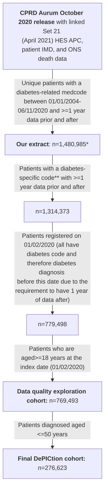
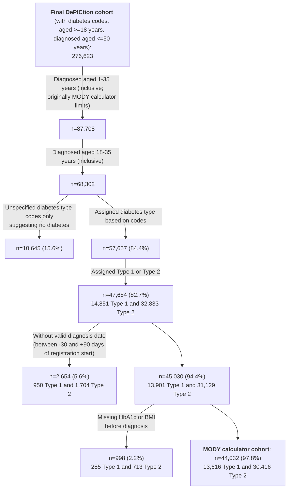
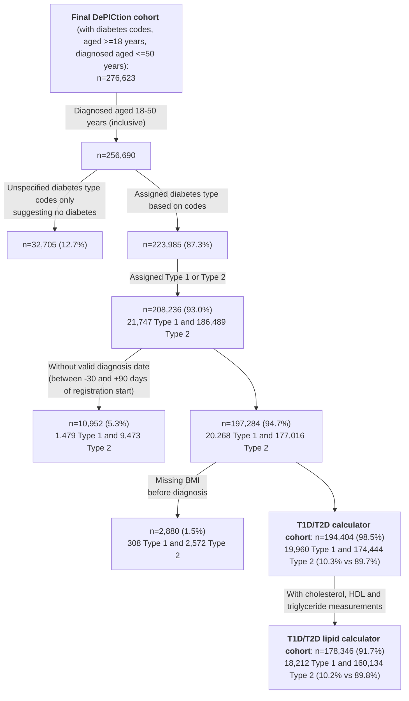

# CPRD-Katie-DePICtion-Scripts

## Introduction

This repository contains the R scripts used to implement the Exeter Diabetes MODY calculator and T1D/T2D calculator in a CPRD Aurum dataset as part of the DePICtion project. Our [CPRD-Cohort-scripts respository](https://github.com/Exeter-Diabetes/CPRD-Cohort-scripts) has similar scripts for defining different cohorts in this same dataset.

&nbsp;

## Rules for data handling

As a result of the work in the 'Initial data quality exploration' directory in this repository, a number of rules for implementing these calculators and dealing with data quality issues were decided upon. These aim to be pragmatic (easily implemented) so that the MODY and T1D/T2D calculators can easily be run in primary care data, whilst excluding as few patients as possible due to e.g. missing data issues. These calculators aim to identify those whose diabetes type is misclassified: i.e. those with a Type 1 or Type 2 diabetes diagnosis who may have MODY, those with a Type 1 diagnosis who may actually have Type 2, and those with a Type 2 diagnosis who may actually have Type 1. The rules aim to minimise the chance of missing these misclassified cases.

&nbsp;

| Rule purpose | &nbsp;&nbsp;&nbsp;&nbsp;&nbsp;&nbsp;&nbsp;&nbsp;Details&nbsp;&nbsp;&nbsp;&nbsp;&nbsp;&nbsp;&nbsp;&nbsp; | Rationale and expected effect | How this is dealt with in our analysis |
| --- | --- | --- | --- |
| Cohort definition | Cohort is everybody with a code for diabetes | This high-sensitivity approach means we include everybody with diabetes, reducing bias which may arise from excluding those with poor quality coding i.e. those who don't have elevated HbA1c measurements in their records. Depending on the codelist used, we may include some people without diabetes who then need to be removed as they will end up with high MODY probabilities. | We have used a very broad codelist, but this identified a large number of individuals with no diabetes type-specific codes who we have not been able to run the calculators on |
| Diabetes type | Diabetes type is determined by codes i.e. if a person has codes for Type 2 diabetes, they are defined as Type 2. If they have codes for multiple types of diabetes, the most recent code is used. If they have no type-specific codes then the clinician needs to check this; the proportion of people with no type-specific codes will vary with the codelist used to define the cohort. | Most recent code is used as their diagnosis may have changed over time. In addition, using most recent code matched the 'gold standard' diagnosis (based on code frequencies - see https://www.jclinepi.com/article/S0895-4356(22)00272-4/fulltext) in 77% of cases for a cohort with both Type 1 and Type 2 codes - see Initial data quality exploration (NB: to be more certain of current diagnosis, those with codes for >1 type of diabetes in the last 5 years can be investigated further). NB: we found that 25% of our gestational diabetes cohort had codes for diabetes (of no specific type) more than 1 year before earliest gestational code or more than 1 year after latest gestational code (excluding 'history of gestational diabetes' codes), suggesting they may have Type 1 or Type 2; we have not applied the calculators to these people | We have implemented these rules, but have only applied the calculators to those with a current diagnosis of Type 1 or Type 2 diabetes (see below flowchart) |
| Diabetes diagnosis date 1 | Diagnosis date is determined as the earliest code for diabetes, excluding those before the date of birth | There is a minimal time difference (see Initial data quality exploration) if the earliest of a code, an elevated HbA1c, or an OHA/insulin script is used instead | We have implemented this rule |
| Diabetes diagnosis date 2 | Those with diagnoses in their year of birth should be investigated further | We found an excess of diabetes codes in the year of birth compared to later years (<1% of our cohort, see Initial data quality exploration), suggesting miscoding. Patients with this issue should be investigated, especially those with Type 1, those with Type 2 who have a high probability of Type 1 from the T1D/T2D calculator, and those with a high MODY probability (as the effect of this issue is to incorrectly lower the age of diagnosis). | For those with Type 2 (and no codes for other types of diabetes), we have ignored diabetes codes in the year of birth |
| Diabetes diagnosis date 3 | Those with diagnoses between -30 and +90 days (inclusive) of registration start) should be investigated further | We found an excess of diabetes codes around registration start (4% of our cohort, see Initial data quality exploration),  (compared to later years; see Initial data quality exploration), probably reflecting old diagnoses (prior to registration) being recorded as if they were new. Patients with this issue should be investigated, especially those with Type 2, those with Type 1 who have a high probability of Type 1 from the T1D/T2D calculator, and all those on which the MODY calculator is being run (as the effect of this issue is to incorrectly increase the age of diagnosis). | We have excluded individuals with diagnosis dates in this time range |
| Biomarkers 1 | BMI, HbA1c, total cholesterol, HDL, and triglyceride values outside of the normal detectable range (BMI: 15-100 kg/m2 (used for adult measurements only), HbA1c: 20-195 mmol/mol, total cholesterol: 0.5-20 mmol/L, HDL: 0.2-10 mmol/L, triglyceride:0.1-40 mmol/L) should be ignored | | We have implemented this rule |
| Biomarkers 2 | The most recent biomarker values can be used, going back as far as (but not before) diagnosis. BMIs in those aged <18 years should be removed. Separate weight and height measurements should not be used to calculate missing BMIs as they do not add much | This reduces missingness in our Type 1 and Type 2 cohorts (compared to using values within the last 2 years only): HbA1c: 6-7% reduced to 1-2%, BMI: 11-18% reduced to 2-4%, total cholesterol: 4-9% reduced to 2%, HDL: 7-14% reduced to 2-3%, triglycerides: 29-37% reduced to 9-11%. | We implemented this rule but looked at the distribution of time between most recent measurement and index date |
| Additional MODY calculator variable 1 | For whether patient is on insulin within 6 months, use time from diagnosis to earliest insulin script. Set to missing if time to insulin is >6 months and registration start is >6 months after diagnosis date and earliest insulin script is within 6 months of registration start. Where missing, use whether they are on insulin now (script within last 6 months) | Missingness was very high for this variable in our Type 1 cohort (51%) as most were diagnosed prior to registration. We are assuming they are already on insulin at registration if there is a script within 6 months of registration; 6 months was chosen as the optimal time for determining current medication based on previous work in CPRD which showed the 90th percentile for time between consecutive insulin scripts for those with diabetes was ~6 months. We do not set time to insulin to missing if the earliest insulin script is within 6 months of diagnosis, even if this is before registration (for our MODY calculator cohort, 9587/42213 (22.7%) of those with an insulin script had their earliest script before registration start) | We implemented this rule but looked at the level of missingness |
| Additional MODY calculator variable 2 | If family history of diabetes is missing, assume they do have a family history, and then investigate this for those who score highly on the MODY calculator | Missingness was high for this variable in our Type 1 and Type 2 cohorts (48-69%) | We implemented this rule |

&nbsp;

## Cohort definition

Using the above rules, we defined a a cohorts of adult with diabetes registered in primary care on 01/02/2020, diagnosed age <=50 years, with diabetes type assigned:

\* Extract actually contained n=1,481,294 unique patients (1,481,884 in total but some duplicates) but included n=309 with registration start dates in 2020 (which did not fulfil the extract criteria of having a diabetes-related medcode between 01/01/2004-06/11/2020 and >=1 year of data after this; some of these were also not 'acceptable' by [CPRD's definition](https://cprd.com/sites/default/files/2023-02/CPRD%20Aurum%20Glossary%20Terms%20v2.pdf)). NB: removing those with registration start date in 2020 also removed all of those with a 'patienttypeid' not equal to 3 ('regular'). See next section for further details on the extract.

\** The list of diabetes-related medcode used for the extract (see below) included some which were not specific to diabetes e.g. 'insulin resistance' and 'seen in diabetes clinic***'. The list of 'diabetes-specific codes' used to define the cohort here can be found in our [CPRD-Codelists respository](https://github.com/Exeter-Diabetes/CPRD-Codelists/blob/main/Diabetes/exeter_medcodelist_all_diabetes.txt).

\***  We determined the code 'Seen in diabetes clinic' (medcode 285223014) to be unspecific to diabetes after observing a large number of patients (>100,000) in our extract with this code and no further evidence of diabetes such as other codes for diabetes, high HbA1c test results, or prescriptions for glucose-lowering medications.

&nbsp;

\* Could also have diabetes codes of unspecified type

&nbsp;

Of the final cohort, 3.5% were non-English speaking, and a further 10.7% had a first language which was not English.

&nbsp;

### Extract details
Patients with a diabetes-related medcode ([full list here](https://github.com/Exeter-Diabetes/CPRD-Katie-MASTERMIND-Scripts/blob/main/Extract-details/diab_med_codes_2020.txt)) in the Observation table were extracted from the October 2020 CPRD Aurum release. See below for full inclusion criteria:

&nbsp;

&nbsp;

## MODY calculator (script: 02b_dpctn_mody_calculator)

The MODY calculator cohort consists those with current diagnosis of Type 1 (mixed or otherwise), Type 2 (mixed or otherwise), or unspecified diabetes, diagnosed aged 18-35 years inclusive:

&nbsp;

### MODY calculator variables

#### HbA1c

Distribution of time between HbA1c and current (index) date (01/02/2020):

| Proportion with HbA1c within time period | Type 1 | Type 2 | Mixed; Type 1 | Mixed; Type 2 | Overall |
| --- | --- | --- | --- | --- | --- |
| 6 months | 55.8% | 60.7% | 61.7% | 63.9% | 60.1% |
| 1 year | 81.7% | 84.7% | 86.7% | 87.9% | 84.6% |
| 2 years | 94.7% | 95.2% | 96.9% | 96.7% | 95.4% |
| 5 years | 99.3% | 99.1% | 99.7% | 99.5% | 99.3% |

&nbsp;

#### BMI

Distribution of time between BMI and current (index) date (01/02/2020):

| Proportion with BMI within time period | Type 1 | Type 2 | Mixed; Type 1 | Mixed; Type 2 | Overall |
| --- | --- | --- | --- | --- | --- |
| 6 months | 43.4% | 49.0% | 47.6% | 51.7% | 48.0% |
| 1 year | 68.9% | 75.2% | 74.5% | 77.4% | 74.0% |
| 2 years | 85.9% | 90.1% | 89.9% | 92.0% | 89.4% |
| 5 years | 97.0% | 98.2% | 98.1% | 98.7% | 98.0% |

&nbsp;

#### Time to insulin (whether within 6 months or not)

|  | Type 1 | Type 2 | Mixed; Type 1 | Mixed; Type 2 | Overall |
| --- | --- | --- | --- | --- | --- |
| Insulin within 6 months = 1 of non-missing | 63.8% | 3.8% | 39.4% | 22.3% | 18.4% |
| Missing insulin within 6 months | 48.7% | 10.6% | 44.5% | 15.4% | 22.9% |
| Current insulin = 1 | 96.1% | 27.9% | 95,7% | 32.0% | 49.6% |
| Insulin within 6 months = 1 or current insulin = 1 if time to insulin missing | 79.7% | 12.3% | 64.9% | 30.4% | 35.0% |

&nbsp;

For those with missing insulin within 6 months (i.e. where they have insulin scripts at some point, registration > 6 months after diagnosis, and earliest insulin script is within the 6 months after registration) but currently treated with insulin, how long between diagnosis and earliest insulin script?

And how long between diagnosis and registration start? (Should be similar to above, time to insulin only treated as missing if first insulin script is within 6 months of registration start)

&nbsp;

#### Family history of diabetes

|  | Type 1 | Type 2 | Mixed; Type 1 | Mixed; Type 2 | Overall |
| --- | --- | --- | --- | --- | --- |
| Family history of diabetes = 1 of non-missing | 73.0% | 86.3% | 75.7% | 83.7% | 82.9% |
| Missing family history of diabetes | 64.9% | 47.4% | 59.9% | 44.3% | 52.0% |

&nbsp;

### MODY calculator results for those with non-missing family history of diabetes

|  | Type 1 | Type 2 | Mixed; Type 1 | Mixed; Type 2 | Overall |
| --- | --- | --- | --- | --- | --- |
| Mean adjusted probability | 10.2% (n=3712) | 14.3% (n=12234) | 11.3% (n=1223) | 20.9% (n=3980) | 14.7% (n=21149) |
| Mean adjusted probability for those of White ethnicity | 9.9% (n=3293) | 12.6% (n=6315) | 10.7% (n=1000) | 18.6% (n=2057) | 12.7% (n=12665) |
| Mean adjusted probability for those of non-White ethnicity | 13.1% (n=382) | 16.2% (n=5774) | 14.2% (n=218) | 23.3% (n=1910) | 17.6% (8284) |

&nbsp;

## T1D/T2D calculator (script: 03b_dpctn_t1dt2d_calculator)

The T1D/T2D calculator cohort consists those with current diagnosis of Type 1 (mixed or otherwise), Type 2 (mixed or otherwise), or unspecified diabetes, diagnosed aged 18-50 years inclusive:

&nbsp;

### T1D/T2D calculator variables

#### BMI

Distribution of time between BMI and current (index) date (01/02/2020):

| Proportion with BMI within time period | Type 1 | Type 2 | Mixed; Type 1 | Mixed; Type 2 | Overall |
| --- | --- | --- | --- | --- | --- |
| 6 months | 44.0% | 50.8% | 48.7% | 52.0% | 50.3% |
| 1 year | 69.7% | 78.2% | 75.4% | 78.4% | 77.5% |
| 2 years | 86.4% | 92.0% | 90.2% | 92.3% | 91.6% |
| 5 years | 97.0% | 98.6% | 98.2% | 98.7% | 98.5% |

&nbsp;

#### Lipids

Distribution of time between **total cholesterol** and current (index) date (01/02/2020):

&nbsp;

Distribution of time between **HDL** and current (index) date (01/02/2020):

&nbsp;

Distribution of time between **triglyceride** and current (index) date (01/02/2020):

&nbsp;

### T1D/T2D calculator results

|  | Type 1 | Type 2 | Mixed; Type 1 | Mixed; Type 2 | Overall |
| --- | --- | --- | --- | --- | --- |
| Mean clinical prediction model probability | 51.0% (n=14486) | 10.6% (n=161010) | 37.3% (n=5474) | 23.1% (n=13434) | 15.2% (n=194404) 
| Mean clinical prediction model probability for those of White ethnicity |51.0% (n=13064) | 8.1% (n=102775) | 37.3% (n=4731) | 20.9% (n=7875) | 14.3% (n=128445) 
| Mean clinical prediction model probability for those of non-White ethnicity | 51.2% (n=1129) | 15.3% (n=54633) | 38.0% (n=658) | 26.4% (n=5438) | 17.2% (n=61858) 
| Mean lipid prediction model probability | 19.1% (n=13033) | 1.5% (n=147496) | 11.9% (n=5179) | 4.3% (n=12638) | 3.3% (n=178346) 
| Mean lipid prediction model probability for those of White ethnicity | 19.2% (n=11760) | 1.1% (n=93715) | 12.2% (n=4467) | 4.2% (n=7337) | 3.5% (n=117279) 
| Mean lipid prediction model probability for those of non-White ethnicity | 18.3% (n=1025) | 2.4% (n=50682) | 10.6% (n=635) | 4.4% (n=5186) | 2.9% (n=57528) 
| Missing lipid prediction model probability | 0.7% | 7.0% | 0.2% | 0.4% | 8.3% |

&nbsp;

