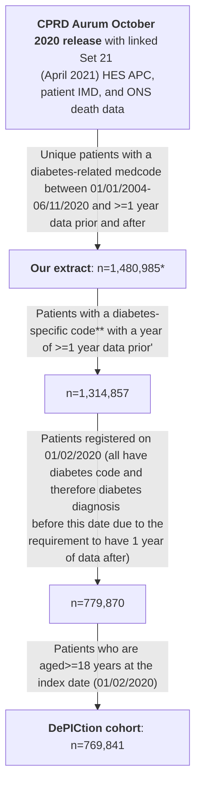
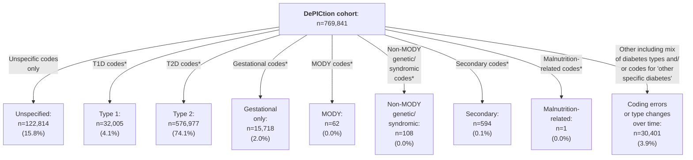

# CPRD-Katie-DePICtion-Scripts

### Introduction

This repository contains the R scripts used to implement the Exeter Diabetes MODY calculator and T1D/T2D calculator in a CPRD Aurum dataset as part of the DePICtion project. Our [CPRD-Cohort-scripts respository](https://github.com/Exeter-Diabetes/CPRD-Cohort-scripts) has similar scripts for defining different cohorts in this same dataset.

The below diagram outlines the data processing steps involved in creating a cohort of adults with diabetes registered in primary care on 01/02/2020 which was used for this work:

\* Extract actually contained n=1,481,294 unique patients (1,481,884 in total but some duplicates) but included n=309 with registration start dates in 2020 (which did not fulfil the extract criteria of having a diabetes-related medcode between 01/01/2004-06/11/2020 and >=1 year of data after this; some of these were also not 'acceptable' by [CPRD's definition](https://cprd.com/sites/default/files/2023-02/CPRD%20Aurum%20Glossary%20Terms%20v2.pdf)). NB: removing those with registration start date in 2020 also removed all of those with a 'patienttypeid' not equal to 3 ('regular'). See next section for further details on the extract.

\** The list of diabetes-related medcode used for the extract (see below) included some which were not specific to diabetes e.g. 'insulin resistance' and 'seen in diabetes clinic***'. The list of 'diabetes-specific codes' used to define the cohort here can be found in our [CPRD-Codelists respository](https://github.com/Exeter-Diabetes/CPRD-Codelists/blob/main/Diabetes/exeter_medcodelist_all_diabetes.txt).

\***  We determined the code 'Seen in diabetes clinic' (medcode 285223014) to be unspecific to diabetes after observing a large number of patients (>100,000) in our extract with this code and no further evidence of diabetes such as other codes for diabetes, high HbA1c test results, or prescriptions for glucose-lowering medications.

&nbsp;

## Extract details
Patients with a diabetes-related medcode ([full list here](https://github.com/Exeter-Diabetes/CPRD-Katie-MASTERMIND-Scripts/blob/main/Extract-details/diab_med_codes_2020.txt)) in the Observation table were extracted from the October 2020 CPRD Aurum release. See below for full inclusion criteria:

&nbsp;

&nbsp;

## Scripts

Data from CPRD was provided as raw text files which were imported into a MySQL database using a custom-built package ([aurum](https://github.com/Exeter-Diabetes/CPRD-analysis-package)) built by Dr Robert Challen. This package also includes functions to allow easy querying of the MySQL tables from R, using the 'dbplyr' tidyverse package. Codelists used for querying the data (denoted as 'codes${codelist_name}' in scripts) can be found in our [CPRD-Codelists repository](https://github.com/Exeter-Diabetes/CPRD-Codelists). 

Our [CPRD-Codelists repository](https://github.com/Exeter-Diabetes/CPRD-Codelists) also contains more details on the algorithms used to define variables such as ethnicity and diabetes type - see individual scripts for links to the appropriate part of the CPRD-Codelists repository.

&nbsp;

### 01_dpctn_cohort
Defines the cohort as per the flowchart above, and adds in patient characteristics (e.g. sex, ethnicity, age at index date) as well as biomarkers values at/prior to index date (BMI, HDL, triglycerides, total cholesterol, HbA1c, GAD/IA2 antibodies, and C-peptide) and family history of diabetes.

&nbsp;

### 02_dpctn_diabetes_type_all_time
Uses diabetes type codes to define diabetes type as per the below flowchart:

\* Could also have diabetes codes of unspecified type. For gestational diabetes only: earliest and latest codes for unspecified diabetes must be no more than a year prior to earliest gestational diabetes code (excluding 'history of gestational diabetes' codes) and no more than a year after latest gestational diabetes code (excluding 'history of gestational diabetes' codes).

\** All gestational diabetes codes (excluding 'history of gestational diabetes' codes) must be earlier than the earliest Type 2 diabetes code.

&nbsp;

This script also looks at how many diabetes codes, high HbA1cs and scripts for glucose-lowering medication have dates before the patient's birth (and so need to be cleaned). For all code categories, and all high HbA1cs and OHA/insulin scripts, >99.9% were on/after the patient's DOB (and only ~0.3% of cohort (1,995/769,841) are affected). The small proportion of codes/high HbA1c/scripts before DOB were excluded from downstream analysis.

&nbsp;

### 03_dpctn_diabetes_diagnosis_dates
Looks at potential quality issues around diagnosis dates (diabetes codes in year of birth) and determines diagnosis date for patients in the cohort (earliest of diabetes code, high HbA1c or script for glucose-lowering medication). Also looks at implications of using diabetes codes only to determine diagnosis dates.

Patients with diabetes type 'other' (as per flowchart above) were excluded (are later analysed in script 04_dpctn_diabetes_type_over_time) as they may have changes in their diagnosed type of diabetes over time. For the remaining cohort, diagnosis date is determined as the earliest diabetes code, high HbA1c or script for glucose-lowering medication. 

To investigate data quality issues, date of diagnosis by calendar year relative to year of birth was analysed:

Clearly there are data quality issues since we would not expect any patients with Type 2 diabetes to be diagnosed in their year of birth. Subsequent analysis ignored diabetes codes in the year of birth for those with Type 2 diabetes, using the next code/high HbA1c/prescription for glucose-lowering medication. This constitutes only 0.3% of those with Type 2 diabetes.

&nbsp;

Also to investigate data quality issues, date of diagnosis by calendar year relative to year of registration start was analysed:

Again, clearly there are data quality issues with more patients than expected being diagnosed in the year where they register with their primary care practice. This probably reflects old diagnoses (prior to registration) being recorded as if they were new. When diagnoses within 3 months (<91 days) of registration start are excluded as per [https://bmjopen.bmj.com/content/7/10/e017989](https://bmjopen.bmj.com/content/7/10/e017989), the data appear more as expected:

Patients with diagnoses within 3 months (<91 days) of registration start were therefore treated as having missing diagnosis dates.

&nbsp;

These potential issues (patients with diagnoses in the year of birth or year of registration start) were then analysed by calendar year to see if there was a particular problem with older data.

Result before cleaning:

Note that as this cohort only include those born in 2002 or earlier, no-one can have diagnosis in their year of birth later than 2002.

Result after cleaning:

There does seem to be a data quality issue with older diagnosis dates being more likely to be in the year of birth, which is not completely solved by ignoring diagnosesin the year of birth for those with Type 2 diabetes. Patients with diagnoses in the year of birth should be flagged to clinicians before running the MODY calculator or T1D/T2D calculator

&nbsp;

The table below shows which out of a diagnosis code, high HbA1c, or prescription for glucose-lowering medication occurred earliest for patients and was therefore used as the date of diagnosis (after codes in the year of birth were removed for those with Type 2 diabetes. 'Missing' indicates patients with a diagnosis within 3 months (<91 days) of registration start. If patients had >1 of a diabetes code, high HbA1c and/or prescription for OHA/insulin on their date of diagnosis, only the highest ranking of these is shown in the table (rank order: diabetes code > high HbA1c > precription for OHA > prescription for insulin).

| Diabetes type (as per flowchart above) | Diabetes code for unspecified type | Diabetes code for specific type | Unspecified and/or type-specific diabetes code | High HbA1c | OHA prescription | Insulin prescription | Missing |
| ---- | ---- | ---- | ---- | ---- | ---- | ---- | ---- |
| Any type* (n=743279) | 273173 (36.8%) | 206310 (27.8%) | 479483 (64.5%) | 222704 (30.0%) | 16779 (2.3%) | 1695 (0.2%) | 27618 (3.7%) |
| Unspecified (n=122814) | 109166 (88.9%) |  (0.0%) | 109166 (88.9%) | 8435 (6.9%) | 3292 (2.7%) | 176 (0.1%) | 1745 (1.4%) |
| Type 1 (n=32005) | 11318 (35.4%) | 16875 (52.7%) | 28193 (88.1%) | 1574 (4.9%) | 189 (0.6%) | 753 (2.4%) | 1296 (4.0%) |
| Type 2 (n=576977) | 144635 (25.1%) | 182636 (31.7%) | 327271 (56.7%) | 212396 (36.8%) | 12414 (2.2%) | 642 (0.1%) | 24254 (4.2%) |
| Gestational only (n=15718) | 7892 (50.2%) | 6497 (41.3%) | 14389 (91.5%) | 72 (0.5%) | 849 (5.4%) | 100 (0.6%) | 308 (2.0%) |
| MODY (n=62) | 12 (19.4%) | 28 (45.2%) | 40 (64.5%) | 15 (24.2%) | 2 (3.2%) | 1 (1.6%) | 4 (6.5%) |
| Non-MODY genetic/syndromic (n=108) | 34 (31.5%) | 52 (48.1%) | 86 (79.6%) | 6 (5.6%) | 5 (4.6%) | 7 (6.5%) | 4 (3.7%) |
| Secondary (n=594) | 115 (19.4%) | 222 (37.4%) | 337 (56.7%) | 206 (34.7%) | 28 (4.7%) | 16 (2.7%) | 7 (1.2%) |
| Malnutrition (n=1) | 1 (100.0%) | 0 (0.0%) | 1 (100.0%) | 0 (0.0%) | 0 (0.0%) | 0 (0.0%) | 0 (0.0%) |

\* Excluding 'other'

&nbsp;

The table below shows what the impact would be of using diabetes code (unspecified type and type-specific) alone to determine diagnosis dates (i.e. not also using high HbA1c and prescriptions for glucose-lowering medication).

| Diabetes type (as per flowchart above) | Median difference in diagnosis date if only diabetes codes used (days) | Median difference in diagnosis date if only diabetes codes used (days) in patients with a high HbA1c/prescription for glucose-lowering medication earlier than a diabetes code |
| ---- | ---- | ---- |
| Any type* (n=719368 with non-missing diagnosis date) | 0 | 26 |
| Unspecified (n=121017 with non-missing diagnosis date) | 0 | 283 |
| Type 1 (n=30664 with non-missing diagnosis date) | 0 | 7 |
| Type 2 (n=551531 with non-missing diagnosis date)| 0 | 24 |
| Gestational only (n=15408 with non-missing diagnosis date) | 0 | 552 |
| MODY (n=57 with non-missing diagnosis date) | 0 | 251 |
| Non-MODY genetic/syndromic (n=104 with non-missing diagnosis date) | 0 | 422 |
| Secondary (n=586 with non-missing diagnosis date) | 0 | 31 |
| Malnutrition (n=1 with non-missing diagnosis date) | 0 | NA |

&nbsp;

### 04_dpctn_diabetes_type_over_time
Looks at patients with codes for >1 type of diabetes (n=30,401; classified as 'other' as per above flowchart) to determine diagnosis dates and when changes in diagnosis occurred.

These are the most popular combinations of diabetes type codes in this group:
* 18,710 (61.5%) Type 1 and Type 2
* 8,704 (28.6%) Type 2 and gestational
* 1,326 (4.4%) Type 2 and secondary
* 352 (1.2%) Type 1 and gestational
* 342 (1.1%) Type 1, Type 2 and gestational
Together these account for 96.9% of those with codes for >1 type of diabetes; all remaining combinations are <1% each.

To do: determine diagnosis dates for most populous groups and when diagnosis changed (or whether codes of second diabetes type are likely to be a mistake).

&nbsp;

### 05_dpctn_diabetes_type_issues
**NB: The MODY and T1D/T2D calculators are only intended for those diagnosed <=50 years of age (MODY: aged 1-35; T1D/T2D: aged 18-50, both inclusive), so in this script, only those diagnosed <50 years of age were included.**

Looks at potential miscoding/misclassification of diabetes/diabetes type, including:
* Those coded as Type 1:
    * With no prescriptions for insulin (could look further at type of insulin e.g. must have basal and bolus; for NDA they exclude from Type 1 if long-acting insulin only)
    * With insulin but also taking an OHA other than metformin/SGLT2-inhibitor (as per NDA)
    * With more than 3 years between diagnosis and initiating insulin treatment
* Those coded as Type 2:
    * With less than 6 months between diagnosis and initiating insulin treatment
    * With no OHA prescriptions prior to insulin initiation
    * With no OHA/insulin prescriptions or high HbA1c measurements
* Those coded as gestational only:
    * With unspecified diabetes codes >1 prior to earliest / >1 year after latest gestational diabetes code (excluding history of gestational diabetes), implying possible Type 1/2 diabetes

Other data issues flagged by previous scripts:
* Those with no type-specific diabetes codes (n=122,814 or 15.8% of the cohrot as per above flowchart)
* Potential issue with diagnosis dates explored in script 03_dpctn_diabetes_diagnosis_dates

&nbsp;

### 06_dpctn_mody_calculator

&nbsp;

### 07_dpctn_t1dt2d_calculator

&nbsp;

Other bits discussed and not implemented:
* Working out whether patients (especially those with Type 1) are being treated in secondary care (and that's why we have missing info)
* Further work on those without any type-specific codes to remove those without diabetes
* Integrating other features which might aid classification: C-peptide, autoimmune conditions, weight change etc.
* Checking small % with remission codes
* Look 

