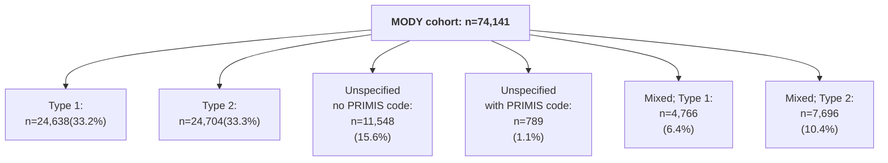

# CPRD-Katie-DePICtion-Scripts

### Introduction

This repository contains the R scripts used to implement the Exeter Diabetes MODY calculator and T1D/T2D calculator in a CPRD Aurum dataset as part of the DePICtion project. Our [CPRD-Cohort-scripts respository](https://github.com/Exeter-Diabetes/CPRD-Cohort-scripts) has similar scripts for defining different cohorts in this same dataset.

&nbsp;

### Rules for data handling

As a result of the work in the 'Initial data quality exploration' directory in this repository, a number of rules for implementing these calculators and dealing with data quality issues were decided upon. These aim to be pragmatic (easily implemented) so that the MODY and T1D/T2D calculators can easily be run in primary care data, whilst excluding as few patients as possible due to e.g. missing data issues. These calculators aim to identify those whose diabetes type is misclassified: i.e. those with a Type 1 or Type 2 diabetes diagnosis who may have MODY, those with a Type 1 diagnosis who may actually have Type 2, and those with a Type 2 diagnosis who may actually have Type 1. The rules aim to minimise the chance of missing these misclassified cases.

&nbsp;

| Rule purpose | &nbsp;&nbsp;&nbsp;&nbsp;&nbsp;&nbsp;&nbsp;&nbsp;Details&nbsp;&nbsp;&nbsp;&nbsp;&nbsp;&nbsp;&nbsp;&nbsp; | Rationale and expected effect | How this is dealt with in our analysis |
| --- | --- | --- | --- |
| Cohort definition | Cohort is everybody with a code for diabetes | This high-sensitivity approach means we include everybody with diabetes, reducing bias which may arise from excluding those with poor quality coding i.e. those who don't have elevated HbA1c measurements in their records. Depending on the codelist used, we may include some people without diabetes who then need to be removed as they will end up with high MODY probabilities. | We have used a very broad codelist, but divided those with no type-specific codes into those with and without a code from a narrower diabetes codelists (PRIMIS codelist). |
| Diabetes type | Diabetes type is determined by codes i.e. if a person has codes for Type 2 diabetes, they are defined as Type 2. If they have codes for multiple types of diabetes, the most recent code is used. If they have no type-specific codes then the clinician needs to check this; the proportion of people with no type-specific codes will vary with the codelist used to define the cohort. | Most recent code is used as their diagnosis may have changed over time. In addition, using most recent code matched the 'gold standard' diagnosis (based on code frequencies - see https://www.jclinepi.com/article/S0895-4356(22)00272-4/fulltext) in 77% of cases for a cohort with both Type 1 and Type 2 codes - see Initial data quality exploration (NB: to be more certain of current diagnosis, those with codes for >1 type of diabetes in the last 5 years can be investigated further). See note on those with gestational diabetes in next rule | We have implemented these rules, but excluded some groups with a small number of patients (see below flowchart) |
| Diabetes type discrepancies | Patients with discrepancies between their diabetes type as determined above and other variables in their records need to be investigated further. NB: those with both Type 1 and Type 2 codes should be excluded from this analysis as they are likely to have these discrepancies, reflecting changes in clinician diagnosis over time | Rules based on https://onlinelibrary.wiley.com/doi/10.1111/j.1464-5491.2011.03419.x and the National Diabetes Audit: * Type 1 with no insulin prescriptions (affected <1% of our Type 1 cohort) * Type 1 with no basal or bolus insulin prescriptions (8% of our Type 1 cohort) * Type 1 with prescription for insulin but also DPP4i/GLP1/SU/TZD (6% of our Type 1 cohort) * Type 1 with more than 3 years between diagnosis and earliest insulin script (5% of our Type 1 cohort) * Type 2 but on insulin within 6 months of diagnosis (2% of our Type 2 cohort) * Type 2 with insulin script but no OHA scripts earlier than this (4% of our Type 2 cohort) * Type 2 with no OHA/insulin scripts or elevated HbA1c measurements (1% of our Type 1 cohort)) * Gestational diabetes but codes for diabetes (of no specific type) more than 1 year before earliest gestational code or more than 1 year after latest gestational code (excluding 'history of gestational diabetes' codes), suggesting they may have Type 1 or Type 2 (25% of our gestational cohort) | We have not implemented these rules or excluded patients with these discrepanices |
| Diabetes diagnosis date 1 | Diagnosis date is determined as the earliest code for diabetes | There is a minimal time difference (see Initial data quality exploration) if the earliest of a code, an elevated HbA1c, or an OHA/insulin script is used instead | We have implemented this rule |
| Diabetes diagnosis date 2 | Those with diagnoses in their year of birth should be investigated further | We found an excess of diabetes codes in the year of birth compared to later years (<1% of our cohort, see Initial data quality exploration), suggesting miscoding. Patients with this issue should be investigated, especially those with Type 1, those with Type 2 who have a high probability of Type 1 from the T1D/T2D calculator, and those with a high MODY probability (as the effect of this issue is to incorrectly lower the age of diagnosis). | For those with Type 2 (and no codes for other types of diabetes), we have ignored diabetes codes in the year of birth |
| Diabetes diagnosis date 3 | Those with diagnoses between -30 and +90 days (inclusive) of registration start) should be investigated further | We found an excess of diabetes codes around registration start (4% of our cohort, see Initial data quality exploration),  (compared to later years; see Initial data quality exploration), probably reflecting old diagnoses (prior to registration) being recorded as if they were new. Patients with this issue should be investigated, especially those with Type 2, those with Type 1 who have a high probability of Type 1 from the T1D/T2D calculator, and all those on which the MODY calculator is being run (as the effect of this issue is to incorrectly increase the age of diagnosis). | We have excluded individuals with diagnosis dates in this time range |
| Biomarkers 1 | BMI, HbA1c, total cholesterol, HDL, and triglyceride values outside of the normal detectable range (BMI: 15-100 kg/m2 (used for adult measurements only), HbA1c: 20-195 mmol/mol, total cholesterol: 0.5-20 mmol/L, HDL: 0.2-10 mmol/L, triglyceride:0.1-40 mmol/L) should be ignored | | We have implemented this rule |
| Biomarkers 2 | The most recent biomarker values can be used, going back as far as (but not before) diagnosis. BMIs in those aged <18 years should be removed. Separate weight and height measurements should not be used to calculate missing BMIs as they do not add much | This reduces missingness in our Type 1 and Type 2 cohorts (compared to using values within the last 2 years only): HbA1c: 6-7% reduced to 1-2%, BMI: 11-18% reduced to 2-4%, total cholesterol: 4-9% reduced to 2%, HDL: 7-14% reduced to 2-3%, triglycerides: 29-37% reduced to 9-11%. | We implemented this rule |
| Additional MODY calculator variable 1 | If whether the patient began insulin within 6 months of diagnosis is missing, use whether they are on insulin now | Missingness was very high for this variable in our Type 1 cohort (66%) as most were diagnosed prior to registration | We implemented this rule |
| Additional MODY calculator variable 2 | If family history of diabetes is missing, assume they do have a family history, and then investigate this for those who score highly on the MODY calculator | Missingness was high for this variable in our Type 1 and Type 2 cohorts (48-69%) | We implemented this rule |

&nbsp;

### Cohort definition

Using the above rules, we defined a a cohorts of adult with diabetes registered in primary care on 01/02/2020, diagnosed age <=50 years, with diabetes type assigned:

\* Extract actually contained n=1,481,294 unique patients (1,481,884 in total but some duplicates) but included n=309 with registration start dates in 2020 (which did not fulfil the extract criteria of having a diabetes-related medcode between 01/01/2004-06/11/2020 and >=1 year of data after this; some of these were also not 'acceptable' by [CPRD's definition](https://cprd.com/sites/default/files/2023-02/CPRD%20Aurum%20Glossary%20Terms%20v2.pdf)). NB: removing those with registration start date in 2020 also removed all of those with a 'patienttypeid' not equal to 3 ('regular'). See next section for further details on the extract.

\** The list of diabetes-related medcode used for the extract (see below) included some which were not specific to diabetes e.g. 'insulin resistance' and 'seen in diabetes clinic***'. The list of 'diabetes-specific codes' used to define the cohort here can be found in our [CPRD-Codelists respository](https://github.com/Exeter-Diabetes/CPRD-Codelists/blob/main/Diabetes/exeter_medcodelist_all_diabetes.txt).

\***  We determined the code 'Seen in diabetes clinic' (medcode 285223014) to be unspecific to diabetes after observing a large number of patients (>100,000) in our extract with this code and no further evidence of diabetes such as other codes for diabetes, high HbA1c test results, or prescriptions for glucose-lowering medications.

&nbsp;

\* Could also have diabetes codes of unspecified type

&nbsp;

Of the final cohort, 3.4% were non-English speaking, and a further 10.5% had a first language which was not English.

&nbsp;

## Extract details
Patients with a diabetes-related medcode ([full list here](https://github.com/Exeter-Diabetes/CPRD-Katie-MASTERMIND-Scripts/blob/main/Extract-details/diab_med_codes_2020.txt)) in the Observation table were extracted from the October 2020 CPRD Aurum release. See below for full inclusion criteria:

&nbsp;

&nbsp;

## MODY calculator (script: 02b_dpctn_mody_calculator)

The MODY calculator cohort consists those with current diagnosis of Type 1 (mixed or otherwise), Type 2 (mixed or otherwise), or unspecified diabetes, diagnosed aged 1-35 years inclusive:

The MODY calculator was additionally run on those with MODY (and no codes for other diabetes types) diagnosed aged 1-35 years inclusive (n=45).

&nbsp;

Cohort characteristics:

| Characteristic | Type 1 | Type 2 | Unspecified with no PRIMIS code | Unspecified with PRIMIS code | Mixed; Type 1 | Mixed; Type 2 | MODY |
| --- | --- | --- | --- | --- | --- | --- | --- |

### 07_dpctn_mody_calculator
Defines MODY calculator cohort: those with current diagnosis of Type 1, Type 2, or unspecified diabetes, diagnosed aged 1-35 years inclusive.

**Not done yet: exploring whether separate weight/height measurements could help with missing BMI**

&nbsp;

Cohort characteristics:
| Characteristic |  Class: Type 1 |  Class: Type 2 | Class: Unspecified | Class: Type 1/Type 2 | Class: Type 2/gestational |
| ---- | ---- | ---- | ---- | ---- | ---- |
| N | 24946 | 26379 | 12646 |||
| Median (IQR) age at diagnosis (years) | 16.2 (13.8) | 30.9 (6.2) | 27.0 (10.7) |||
| Median (IQR) current age (years) | 39.6 (23.0) | 42.9 (14.0) | 32.6 (10.9) |||
| Median (IQR) BMI within 2 years (kg/m2) | 26.2 (6.7) | 32.0 (10.1) | 28.5 (10.6) |||
| Missing BMI within 2 years | 4256 (17.06%) | 2920 (11.07%) | 7303 (57.75%) |||
| Median (IQR) time from BMI within 2 years to index date (days) | 184.0 (258.0) | 164.0 (231.0) | 242.0 (322.0) |||
| Median (IQR) BMI any time >=diagnosis (kg/m2) | 26.0 (6.6) | 32.0 (10.0) | 28.0 (10.3) |||
| Missing BMI >=diagnosis | 441 (1.77%) | 391 (1.48%) | 5215 (41.24%) |||
| Median (IQR) time from BMI any time >=diagnosis to index date (days) | 232.0 (398.0) | 187.0 (287.0) | 380.0 (795.0) |||
| Median (IQR) HbA1c within 2 years (mmol/mol) | 66.0 (21.1) | 61.9 (29.0) | 37.0 (8.0) |||
| Missing (IQR) HbA1c within 2 years | 1756 (7.04%) | 1434 (5.44%) | 8083 (63.92%) |||
| Median time from HbA1c within 2 years to index date (days) | 151.0 (212.0) | 131.0 (176.0) | 263.0 (314.0) |||
| Median (IQR)  HbA1c any time >=diagnosis (mmol/mol) | 67.0 (22.0) | 61.9 (29.1) | 36.0 (6.8) |||
| Missing HbA1c >=diagnosis | 180 (0.72%) | 115 (0.44%) | 6961 (55.05%) |||
| Median (IQR) time from HbA1c any time >=diagnosis to index date (days) | 165.0 (250.0) | 141.0 (207.0) | 353.0 (606.0) |||
| With negative family history of diabetes | 2024 (8.11%) | 1933 (7.33%) | 1074 (8.49%) |||
| With positive family history of diabetes | 5845 (23.43%) | 11765 (44.60%) | 2492 (19.71%) |||
| Missing family history of diabetes | 17077 (68.46%) | 12681 (48.07%) | 9080 (71.80%) |||
| Not on insulin <= 6 months after diagnosis | 2220 (8.90%) | 20382 (77.27%) | 12349 (97.65%) |||
| On insulin <= 6 months after diagnosis | 5879 (23.57%) | 736 (2.79%) | 158 (1.25%) |||
| Missing whether on insulin <= 6 months after diagnosis | 16847 (67.53%) | 5261 (19.94%) | 139 (1.10%) |||
| On OHA or ins (script in last 6 months) | 24021 (96.29%) | 22040 (83.55%) | 529 (4.18%) ||| 
| Missing any variable required for MODY calculator if use BMI and HbA1c back to diagnosis | 23266 (93.27%) | 15779 (59.81%) | 10913 (86.30%)|||

&nbsp;

Characteristics of those with no missing MODY calculator variables:
| Characteristic | Class: Unspecified |  Class: Type 1 |  Class: Type 2 | Class: Type 1/Type 2 | Class: Type 2/gestational |
| ---- | ---- | ---- | ---- | ---- | ---- |
| N | 1680 | 10600 | 1733
| Median age at diagnosis | 23.1 (15.3) | 31.3 (5.7) | 30.1 (7.4) |||
| Median (IQR) current age (years | 36.6 (19.0) | 41.6 (11.0) | 36.6 (9.0) |||
| Median BMI any time >=diagnosis | 26.2 (6.8) | 31.9 (9.9) | 30.2 (10.8) |||
| Median HbA1c any time >=diagnosis | 69.0 (25.0) | 59.0 (27.5) | 37.7 (8.0) |||
| With negative family history of diabetes | 493 (29.35%) | 1566 (14.77%) | 456 (26.31%) |||
| With positive family history of diabetes | 1187 (70.65%) | 9034 (85.23%) | 1277 (73.69%) |||
| Not on insulin <= 6 months after diagnosis | 550 (32.74%) | 10291 (97.08%) | 1696 (97.86%) |||
| On insulin <= 6 months after diagnosis | 1130 (67.26%) | 309 (2.92%) | 37 (2.14%) |||
| On OHA or ins (script in last 6 months) | 1613 (96.01%) | 8651 (81.61%) | 137 (7.91%) |||

&nbsp;

Adjusted MODY probabilities for complete cases:

&nbsp;

### 08_dpctn_t1dt2d_calculator
Defines T1DT2D calculator cohort: those with current diagnosis of Type 1, Type 2, or unspecified diabetes, diagnosed aged 18-50 years inclusive.

**Not done yet: exploring whether separate weight/height measurements could help with missing BMI**

&nbsp;

Cohort characteristics:
| Characteristic |  Class: Type 1 |  Class: Type 2 | Class: Unspecified | Class: Type 1/Type 2 | Class: Type 2/gestational |
| ---- | ---- | ---- | ---- | ---- | ---- |
| N | 14887 | 167485 | 32609 |||
| Median (IQR) age at diagnosis (years) | 28.5 (12.8) | 43.5 (8.7) | 40.3 (13.4) |||
| Median (IQR) current age (years | 49.6 (20.7) | 53.8 (12.0) | 45.6 (13.0) |||
| Median (IQR) BMI within 2 years (kg/m2) | 26.5 (6.5) | 31.2 (8.7) | 29.7 (9.4) |||
| Missing BMI within 2 years | 2242 (15.06%) | 14944 (8.92%) | 15710 (48.18%) |||
| Median (IQR) time from BMI within 2 years to index date (days) | 178.0 (249.0) | 158.0 (222.0) | 242.0 (316.0) |||
| Median (IQR) BMI any time >=diagnosis (kg/m2) | 26.4 (6.5) | 31.2 (8.8) | 29.1 (9.1) |||
| Missing BMI >=diagnosis | 273 (1.83%) | 1970 (1.18%) | 10263 (31.47%) |||
| Median (IQR) time from BMI any time >=diagnosis to index date (days) | 215.0 (355.0) | 178.0 (262.0) | 358.0 (715.0) |||
| Median (IQR) total cholesterol within 2 years (mmol/L) | 4.4 (1.3) | 4.2 (1.4) | 4.9 (1.3) |||
| Missing total cholesterol within 2 years | 1284 (8.62%) | 7150 (4.27%) | 16455 (50.46%) |||
| Median (IQR) time from total cholesterol within 2 years to index date (days) | 182.0 (231.0) | 165.0 (194.0) | 256.0 (305.0) |||
| Median (IQR) total cholesterol any time >=diagnosis (mmol/L) | 4.4 (1.3) | 4.2 (1.5) | 4.9 (1.4) |||
| Missing total cholesterol >=diagnosis | 229 (1.54%) | 967 (0.58%) | 12848 (39.40%) |||
| Median (IQR) time from total cholesterol any time >=diagnosis to index date (days) | 199.0 (262.0) | 172.0 (207.0) | 340.0 (623.0) |||
| Median (IQR) HDL within 2 years (mmol/L) | 1.5 (0.6) | 1.1 (0.4) | 1.3 (0.4) |||
| Missing HDL within 2 years | 2054 (13.80%) | 11539 (6.89%) | 16919 (51.88%) |||
| Median (IQR) time from HDL within 2 years to index date (days) | 190.0 (244.0) | 171.0 (198.0) | 260.0 (304.0) |||
| Median (IQR) HDL any time >=diagnosis (mmol/L)| 1.5 (0.6) | 1.1 (0.4) | 1.3 (0.5) |||
| Missing HDL >=diagnosis | 423 (2.84%) | 1880 (1.12%) | 13313(40.83%) |||
| Median (IQR) time from HDL any time >=diagnosis to index date (days) | 219.0 (313.0) | 183.0 (225.0) | 346.0 (637.2 |||
| Median (IQR) triglyceride within 2 years (mmol/L) | 1.1 (0.8) | 1.7 (1.3) | 1.4 (1.1) |||
| Missing triglyceride within 2 years | 5462 (36.69%) | 48337 (28.86%) | 20386 (62.52%) |||
| Median (IQR) time from triglyceride within 2 years to index date (days) | 208.0 (263.0) | 190.0 (227.0) | 270.0 (311.5) |||
| Median (IQR) triglyceride any time >=diagnosis (mmol/L) | 1.1 (0.8) | 1.7 (1.3) | 1.4 (1.1) |||
| Missing triglyceride >=diagnosis | 1531 (10.28%) | 11115 (6.64%) | 16128 (49.46%) |||
| Median (IQR) time from triglyceride any time >=diagnosis to index date (days) | 337.0 (802.0) | 261.0 (570.0) | 416.0 (839.0) |||
| Missing any variable required for MODY calculator if use biomarkers back to diagnosis | 1693 (11.37%) | 12588 (7.52%) | 18342 (56.25%) |||

&nbsp;

Number with measured GAD and/or IA2 antibodies is very small:
* GAD: 127 (0.9%) of Type 1, 431 (0.03%) of Type 2, 35 (0.1%) of unspecified
* IA2: 4 (0.03%) of Type 1, 9 (0.005%) of Type 2, 0 (0.0%) of unspecified

&nbsp;

T1D probability using age and BMI only:

&nbsp;

T1D probability using age, BMI and lipids:

&nbsp;

### Other bits discussed and not implemented:
* Working out whether patients (especially those with Type 1) are being treated in secondary care (and that's why we have missing info)
* Further work on those without any type-specific codes to remove those without diabetes
* Integrating other features which might aid classification:
    * At diagnosis:
        * Polydipsia
        * Ketones
        * Glucose
        * Capillary glucose
        * Weight loss
        * DKA
    * And longitudinally:
        * C-peptide
        * Islet Abs
        * Autoimmune tests e.g. thyroid function, TTG (coeliac) - Lancet paper
        * Type changing over time
        * Referral to endo?
* Later: outcomes affected by misclassification including infection
* Checking small % with remission codes - compare to 2x papers and possibly UKBB
